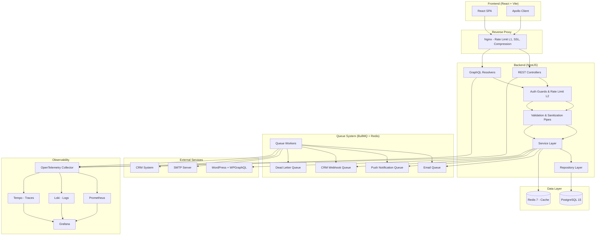
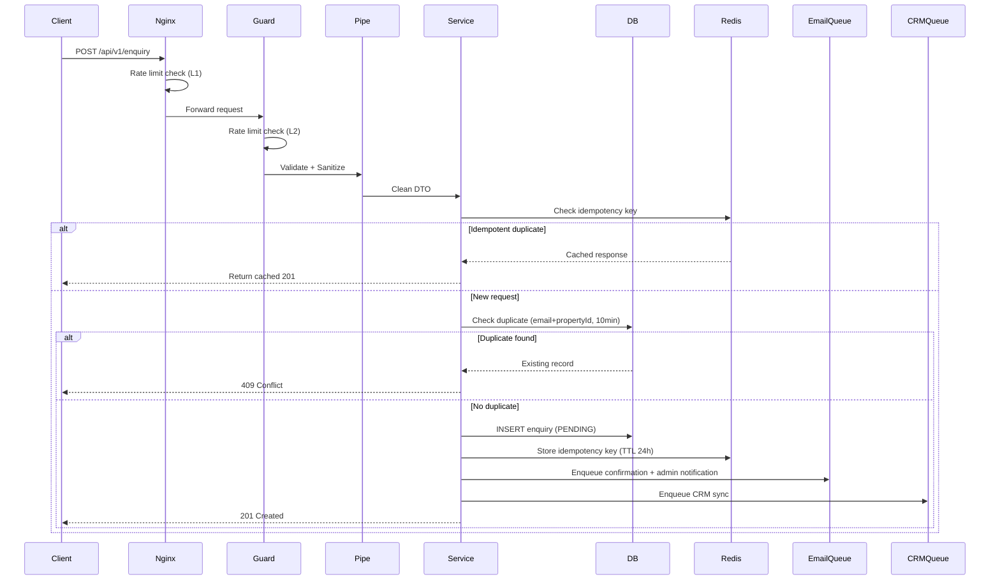
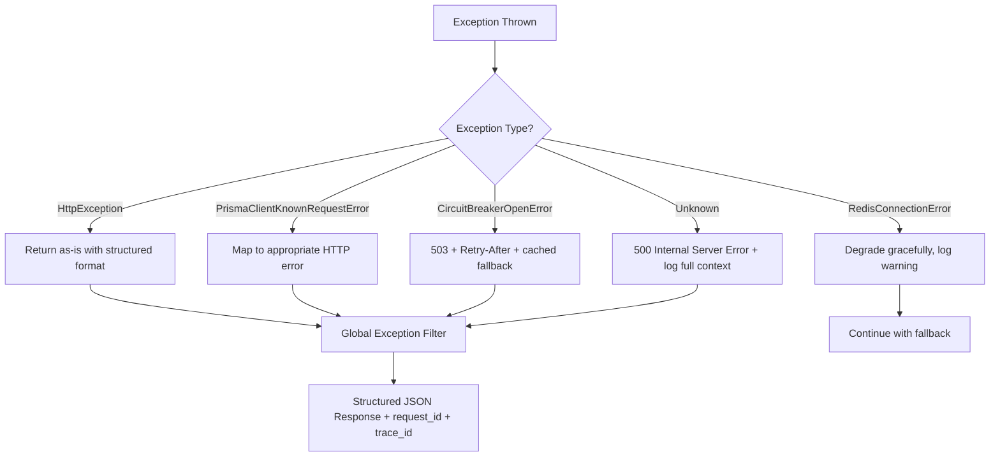
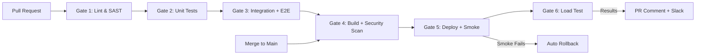
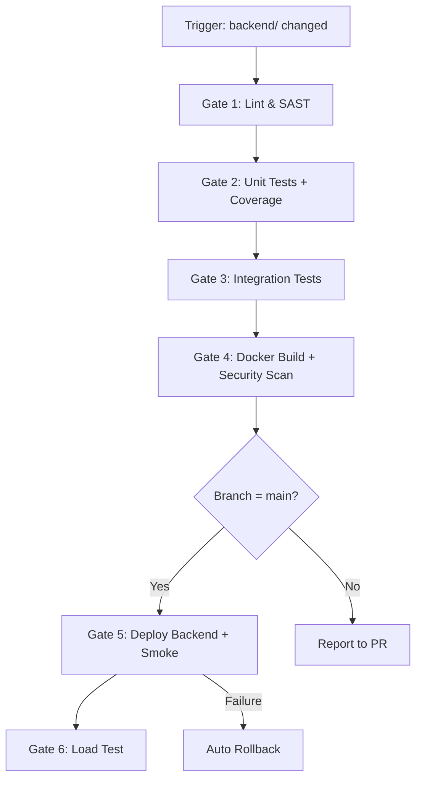
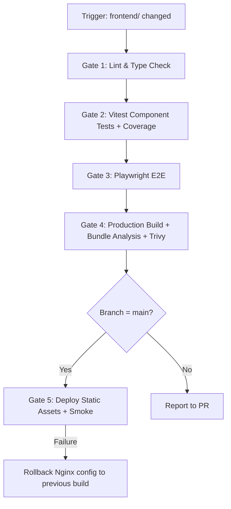

# Design Document: Enquiry Backend Platform

## Overview

The Enquiry Backend Platform is a production-ready, API-driven system for managing property enquiries, CRM integrations, WordPress content delivery, and real-time notifications. It uses a flat two-folder architecture with a NestJS backend and React (Vite) frontend as completely isolated applications, orchestrated via Docker Compose at the repository root.

### Key Design Goals

- **Resilience**: Circuit breakers, retries with exponential backoff, DLQ, graceful degradation
- **Performance**: Cursor pagination, DataLoader batching, Redis caching with SWR, connection pooling
- **Security**: HMAC webhook validation, tiered rate limiting, input sanitization, parameterized queries
- **Observability**: OpenTelemetry traces/metrics/logs, Prometheus, Grafana dashboards, structured alerting
- **Data Integrity**: Idempotency keys, optimistic locking, transactional audit logging, duplicate detection

### Technology Stack

| Layer | Technology |
|-------|-----------|
| Backend Framework | NestJS (TypeScript) |
| ORM | Prisma with PostgreSQL 15 |
| Cache & Queues | Redis 7, BullMQ |
| API | REST (enquiry, webhook, admin) + GraphQL (properties) |
| CMS | WordPress + WPGraphQL |
| Frontend | React (Vite) + Tailwind CSS + Apollo Client |
| Observability | OpenTelemetry + Prometheus + Grafana + Loki + Tempo |
| API Documentation | Swagger (OpenAPI 3.0) via @nestjs/swagger |
| Testing (Backend) | Jest + Supertest + k6 + fast-check |
| Testing (Frontend) | Vitest + Playwright |
| Deployment | Docker + PM2 + Nginx, GitHub Actions CI/CD (separate pipelines) |


## Architecture

### High-Level Architecture




### Architectural Patterns

1. **Isolated Applications**: Backend and frontend are completely independent — separate repos-in-a-folder with own dependency trees, build tooling, and CI/CD
2. **Layered Architecture**: Controllers → Services → Repositories → Prisma/DB
3. **Event-Driven Processing**: Enquiry creation emits events to email and CRM queues
4. **CQRS-Lite**: Reads served from Redis cache, writes go directly to PostgreSQL
5. **Repository Pattern**: Abstract data access behind repository interfaces for testability
6. **Guard/Interceptor Pattern**: Cross-cutting concerns (auth, rate limiting, logging) as NestJS decorators
7. **Circuit Breaker**: Opossum wraps all external service calls (WordPress, SMTP, CRM)
8. **Bulkhead Isolation**: Separate queue workers per concern prevent cascading failures

### Request Flow: Enquiry Creation




### Project Structure

```
enquiry-backend-platform/
├── backend/                      # NestJS application (completely isolated)
│   ├── src/
│   │   ├── modules/
│   │   │   ├── enquiry/          # Enquiry CRUD + validation
│   │   │   ├── webhook/          # CRM webhook handler
│   │   │   ├── notification/     # Email + push queue producers
│   │   │   ├── property/         # WordPress GraphQL + cache
│   │   │   ├── health/           # Liveness + readiness probes
│   │   │   ├── gdpr/             # Data export + erasure
│   │   │   ├── audit/            # Audit logging
│   │   │   └── admin/            # Bull Board + queue management
│   │   ├── common/
│   │   │   ├── dto/              # BaseQueryDto, shared pagination types
│   │   │   ├── response/         # ApiResponse envelope, TransformInterceptor, error codes
│   │   │   ├── guards/           # API key, rate limit guards
│   │   │   ├── interceptors/     # Logging, ETag, compression
│   │   │   ├── pipes/            # Validation, sanitization
│   │   │   ├── filters/          # Global exception filter (ApiErrorResponse format)
│   │   │   ├── decorators/       # Custom decorators (@RateLimit, etc.)
│   │   │   └── utils/            # Shared utilities
│   │   ├── config/               # Configuration module
│   │   ├── database/             # Prisma service + repositories
│   │   ├── queue/                # BullMQ setup + workers
│   │   ├── cache/                # Redis cache service + SWR
│   │   ├── observability/        # OpenTelemetry setup
│   │   ├── swagger/              # Swagger config + document builder
│   │   └── main.ts
│   ├── prisma/
│   │   ├── schema.prisma
│   │   └── migrations/
│   │       ├── <timestamp>_create_enquiries_table/
│   │       │   └── migration.sql
│   │       ├── <timestamp>_create_webhook_events_table/
│   │       │   └── migration.sql
│   │       ├── <timestamp>_create_properties_table/
│   │       │   └── migration.sql
│   │       └── <timestamp>_create_audit_logs_table/
│   │           └── migration.sql
│   ├── test/
│   │   ├── unit/
│   │   ├── integration/
│   │   ├── regression/           # Security regression tests (SQL injection, XSS, etc.)
│   │   ├── smoke/                # Post-deployment smoke test suite
│   │   └── k6/                   # Load test scenarios (spike, soak, stress, smoke)
│   ├── package.json
│   ├── tsconfig.json
│   ├── .eslintrc.js
│   ├── jest.config.ts
│   ├── Dockerfile
│   └── .github/
│       └── workflows/
│           └── backend-ci.yml    # Backend-only CI/CD pipeline
├── frontend/                     # React (Vite) application (completely isolated)
│   ├── src/
│   │   ├── auth/
│   │   │   ├── users.ts         # Static users, roles, permissions
│   │   │   ├── AuthContext.tsx   # Auth state provider
│   │   │   ├── ProtectedRoute.tsx # Route guard component
│   │   │   ├── PermissionGate.tsx # UI element permission wrapper
│   │   │   └── index.ts
│   │   ├── pages/
│   │   │   ├── LoginPage.tsx
│   │   │   ├── UnauthorizedPage.tsx
│   │   │   ├── EnquiryFormPage.tsx
│   │   │   ├── PropertyListPage.tsx
│   │   │   ├── PropertyDetailPage.tsx
│   │   │   ├── AdminDashboardPage.tsx
│   │   │   ├── QueueDashboardPage.tsx
│   │   │   └── GdprToolsPage.tsx
│   │   ├── components/
│   │   │   ├── ErrorBoundary.tsx
│   │   │   ├── OfflineBanner.tsx
│   │   │   └── SkeletonLoader.tsx
│   │   ├── hooks/
│   │   │   ├── useOnlineStatus.ts    # Network connectivity detection
│   │   │   ├── usePersistedForm.ts   # localStorage form persistence
│   │   │   ├── useEnquiries.ts       # React Query wrapper
│   │   │   ├── useCreateEnquiry.ts   # Mutation with cache invalidation
│   │   │   └── useApiData.ts         # Generic fetch with cancel + retry
│   │   ├── providers/
│   │   │   ├── QueryProvider.tsx     # React Query client config
│   │   │   ├── ApolloProvider.tsx    # Apollo Client config + cache policies
│   │   │   └── UIProvider.tsx        # Toast notifications + global loading
│   │   ├── graphql/
│   │   ├── services/
│   │   │   └── api/
│   │   │       ├── client.ts     # Axios instance + interceptors + retry
│   │   │       ├── types.ts      # ApiResponse<T>, PaginatedResponse<T>, error types
│   │   │       ├── enquiry.api.ts
│   │   │       ├── property.api.ts
│   │   │       ├── webhook.api.ts
│   │   │       ├── health.api.ts
│   │   │       ├── gdpr.api.ts
│   │   │       ├── admin.api.ts
│   │   │       ├── audit.api.ts
│   │   │       └── index.ts     # Barrel export
│   │   ├── types/                # Frontend TypeScript interfaces (no shared package)
│   │   └── utils/
│   ├── test/
│   │   ├── unit/
│   │   └── e2e/                  # Playwright E2E tests
│   ├── package.json
│   ├── tsconfig.json
│   ├── .eslintrc.js
│   ├── vitest.config.ts
│   ├── playwright.config.ts
│   ├── Dockerfile
│   └── .github/
│       └── workflows/
│           └── frontend-ci.yml   # Frontend-only CI/CD pipeline
├── docker-compose.yml            # Orchestrates both + infra services (dev)
├── docker-compose.prod.yml       # Production compose with resource limits
├── observability/                # Shared observability configs
│   ├── prometheus/
│   │   ├── prometheus.yml
│   │   └── alerts.yml
│   ├── grafana/
│   │   ├── provisioning/
│   │   └── dashboards/
│   ├── loki/
│   └── tempo/
├── nginx/                        # Nginx configs
│   ├── nginx.conf
│   ├── conf.d/
│   └── ssl/
├── scripts/
│   ├── backup.sh                 # Automated PostgreSQL backup with retention
│   ├── restore.sh                # Database restore from backup
│   ├── deploy.sh                 # Manual deployment orchestration
│   ├── harden-vps.sh             # Ubuntu 22.04 security hardening
│   ├── setup-ssl.sh              # Let's Encrypt SSL provisioning
│   └── generate-security-report.ts  # Aggregate scan results into SECURITY_REPORT.md
└── docs/
    ├── RUNBOOK.md
    ├── DEPLOYMENT.md             # VPS setup, Docker deployment, SSL, environment vars
    ├── PERFORMANCE.md            # Optimization documentation with before/after metrics
    ├── API.md                    # Links to Swagger UI + OpenAPI spec export
    └── SECURITY_REPORT.md
```

### Isolation Principles

- **No shared packages**: Each application is fully self-contained with its own `package.json`, `node_modules`, `tsconfig.json`, ESLint config, and test setup.
- **Type sharing strategy**: The frontend maintains its own TypeScript interfaces in `frontend/src/types/`. Types are kept in sync manually or via OpenAPI codegen from the backend's API schema — there is no `packages/shared` folder.
- **Independent CI/CD**: The backend and frontend each have their own GitHub Actions workflow. A change to `backend/` only triggers the backend pipeline; a change to `frontend/` only triggers the frontend pipeline.
- **Separate Dockerfiles**: `backend/Dockerfile` builds the NestJS app; `frontend/Dockerfile` builds the React SPA (served via Nginx or a static server).
- **Docker Compose at root**: The root `docker-compose.yml` orchestrates both application containers plus PostgreSQL, Redis, WordPress, and the observability stack.


## Components and Interfaces

### API Global Prefix & Versioning

The `api` prefix and version segment (`v1`) are configured globally in `main.ts` using NestJS built-in support — controllers never hardcode these.

```typescript
// backend/src/main.ts
import { VersioningType } from '@nestjs/common';

const app = await NestFactory.create(AppModule);

// Global prefix: all routes start with /api
app.setGlobalPrefix('api');

// URI versioning: /api/v1/..., /api/v2/...
app.enableVersioning({
  type: VersioningType.URI,
  defaultVersion: '1',   // All controllers default to v1 unless overridden
});
```

**Result**: A controller with `@Controller('enquiry')` serves at `/api/v1/enquiry`. To introduce v2, add `@Version('2')` on the controller or individual route — no path changes needed.

**Excluding routes from prefix/versioning** (e.g., health probes):

```typescript
// Health probes live at /health/live and /health/ready — no prefix, no version
@Controller({ path: 'health', version: '' })
export class HealthController { ... }
```

In `main.ts`, exclude health from global prefix:
```typescript
app.setGlobalPrefix('api', {
  exclude: [{ path: 'health/(.*)', method: RequestMethod.ALL }],
});
```

**Version Override (per-controller or per-route):**

```typescript
// Entire controller on v2
@Controller('enquiry')
@Version('2')
class EnquiryV2Controller { ... }

// Single route on v2, rest on default v1
@Controller('enquiry')
class EnquiryController {
  @Get(':id')
  @Version('2')
  findOneV2(@Param('id') id: string): Promise<EnquiryResponseV2> { ... }
}
```

### Backend Modules

#### 1. Enquiry Module

**Responsibility**: CRUD operations for property enquiries with validation, sanitization, duplicate detection, and idempotency.

```typescript
// EnquiryController
@Controller('enquiry')
class EnquiryController {
  @Post()
  create(@Body() dto: CreateEnquiryDto, @Headers('Idempotency-Key') key?: string): Promise<EnquiryResponse>;

  @Get(':id')
  findOne(@Param('id') id: string): Promise<EnquiryResponse>;

  @Get()
  findAll(@Query() query: ListEnquiriesDto): Promise<PaginatedResponse<EnquiryResponse>>;
}

// EnquiryService
class EnquiryService {
  create(dto: CreateEnquiryDto, idempotencyKey?: string): Promise<Enquiry>;
  findById(id: string): Promise<Enquiry>;
  findAll(params: ListParams): Promise<PaginatedResult<Enquiry>>;
  checkDuplicate(email: string, propertyId: string): Promise<boolean>;
}

// EnquiryRepository
class EnquiryRepository {
  create(data: Prisma.EnquiryCreateInput): Promise<Enquiry>;
  findById(id: string): Promise<Enquiry | null>;
  findWithCursor(params: CursorPaginationParams): Promise<CursorResult<Enquiry>>;
  findDuplicate(email: string, propertyId: string, withinMinutes: number): Promise<Enquiry | null>;
}
```

#### 2. Webhook Module

**Responsibility**: Receive, validate (HMAC + API key), and enqueue CRM webhook events. List and query webhook event history.

```typescript
// WebhookController
@Controller('webhook')
class WebhookController {
  @Post('crm')
  @UseGuards(ApiKeyGuard, HmacGuard)
  @RateLimit({ limit: 200, window: 60, scope: 'apiKey' })
  receiveCrmEvent(@Body() payload: WebhookPayloadDto, @Headers() headers: Record<string, string>): Promise<void>;

  @Get('events')
  @RateLimit({ limit: 60, window: 60, scope: 'ip' })
  listEvents(@Query() query: ListWebhookEventsDto): Promise<PaginatedResponse<WebhookEventResponse>>;
}

// WebhookService
class WebhookService {
  processEvent(payload: WebhookPayloadDto, eventId: string): Promise<void>;
  isEventProcessed(eventId: string): Promise<boolean>;
  findAll(params: ListWebhookEventsDto): Promise<PaginatedResult<WebhookEvent>>;
}

// WebhookRepository
class WebhookRepository {
  create(data: Prisma.WebhookEventCreateInput): Promise<WebhookEvent>;
  findByEventId(eventId: string): Promise<WebhookEvent | null>;
  findWithCursor(params: CursorPaginationParams): Promise<CursorResult<WebhookEvent>>;
  updateStatus(id: string, status: WebhookStatus, errorMessage?: string): Promise<WebhookEvent>;
}

// HmacGuard
class HmacGuard implements CanActivate {
  canActivate(context: ExecutionContext): boolean;
  validateSignature(payload: string, signature: string, secret: string): boolean;
}
```


#### 3. Notification Module

**Responsibility**: Produce and consume email/push notification jobs via BullMQ.

```typescript
// NotificationProducer
class NotificationProducer {
  enqueueConfirmationEmail(enquiry: Enquiry): Promise<Job>;
  enqueueAdminNotification(enquiry: Enquiry): Promise<Job>;
  enqueuePushNotification(event: CrmEvent, recipients: string[]): Promise<Job>;
}

// EmailWorker (BullMQ Processor)
@Processor('email-queue')
class EmailWorker {
  @Process()
  handleEmail(job: Job<EmailJobData>): Promise<void>;
}

// PushWorker (BullMQ Processor)
@Processor('push-queue')
class PushWorker {
  @Process()
  handlePush(job: Job<PushJobData>): Promise<void>;
}
```

#### 4. Property Module (GraphQL)

**Responsibility**: Serve WordPress property data via GraphQL with caching, SWR, circuit breaker, DataLoader, and full search/filter/sort support.

```typescript
// PropertyResolver
@Resolver()
class PropertyResolver {
  @Query()
  properties(@Args() args: PropertyConnectionArgs): Promise<PropertyConnection>;

  @Query()
  property(@Args('slug') slug?: string, @Args('wpId') wpId?: number): Promise<Property>;
}

// PropertyConnectionArgs (enhanced with search/filter/sort)
class PropertyConnectionArgs {
  @IsOptional() @IsInt() @Min(1) @Max(100)
  first?: number = 20;

  @IsOptional() @IsString()
  after?: string;

  @IsOptional() @IsString()
  search?: string;         // ILIKE on title, content, excerpt

  @IsOptional() @IsIn(['TITLE', 'CREATED_AT', 'CACHED_AT'])
  sortBy?: 'TITLE' | 'CREATED_AT' | 'CACHED_AT' = 'CACHED_AT';

  @IsOptional() @IsIn(['ASC', 'DESC'])
  sortDir?: 'ASC' | 'DESC' = 'DESC';
}

// GraphQL Schema additions
// enum PropertySortField { TITLE, CREATED_AT, CACHED_AT }
// enum SortDirection { ASC, DESC }

// WordPressClient
class WordPressClient {
  fetchProperties(pagination: { first: number; after?: string }): Promise<PropertyEdge[]>;
  fetchPropertyBySlug(slug: string): Promise<Property>;
  fetchPropertyByWpId(wpId: number): Promise<Property>;
}

// PropertyCacheService (SWR Strategy)
class PropertyCacheService {
  get(key: string): Promise<CacheResult<Property>>;
  set(key: string, value: Property, ttl: number): Promise<void>;
  invalidateAll(): Promise<void>;
  isStale(cachedAt: Date): boolean;    // > 5 min
  isExpired(cachedAt: Date): boolean;  // > 15 min
}

// PropertyDataLoader
class PropertyDataLoader {
  load(id: string): Promise<Property>;
  loadMany(ids: string[]): Promise<Property[]>;
}

// PropertyRepository (for local DB queries with search/sort)
class PropertyRepository {
  findWithCursor(params: { first: number; after?: string; search?: string; sortBy?: string; sortDir?: string }): Promise<CursorResult<Property>>;
  findBySlug(slug: string): Promise<Property | null>;
  findByWpId(wpId: number): Promise<Property | null>;
  upsertBatch(properties: PropertyInput[]): Promise<void>;
}
```


#### 5. Cache Module

**Responsibility**: Redis cache with SWR strategy, fallback to in-memory LRU on Redis failure.

```typescript
// CacheService
class CacheService {
  get<T>(key: string): Promise<CacheEntry<T> | null>;
  set<T>(key: string, value: T, options: CacheOptions): Promise<void>;
  delete(key: string): Promise<void>;
  invalidatePattern(pattern: string): Promise<void>;
  pipeline(ops: CacheOperation[]): Promise<void>;
  isHealthy(): boolean;
}

// CacheEntry<T>
interface CacheEntry<T> {
  data: T;
  cachedAt: number;
  ttl: number;
  staleThreshold: number;  // 5 min
  expireThreshold: number; // 15 min
}

// InMemoryFallback (LRU)
class InMemoryLRUCache {
  get<T>(key: string): T | null;
  set<T>(key: string, value: T, ttlSeconds: number): void;
  size(): number;
  clear(): void;
}
```

#### 6. Health Module

**Responsibility**: Liveness and readiness probe endpoints.

```typescript
// HealthController
@Controller('health')
class HealthController {
  @Get('live')
  liveness(): { status: 'ok' };

  @Get('ready')
  readiness(): Promise<ReadinessResponse>;
}

// HealthService
class HealthService {
  checkPostgres(): Promise<HealthStatus>;
  checkRedis(): Promise<HealthStatus>;
  checkQueues(): Promise<HealthStatus>;
}
```

#### 7. GDPR Module

**Responsibility**: Data export and erasure for GDPR compliance. Export is paginated for large datasets.

```typescript
// GdprController
@Controller('gdpr')
class GdprController {
  @Get('export/:email')
  @RateLimit({ limit: 5, window: 60, scope: 'ip' })
  exportData(@Param('email') email: string, @Query() query: GdprExportQueryDto): Promise<PaginatedResponse<GdprRecord>>;

  @Delete('erase/:email')
  @RateLimit({ limit: 3, window: 60, scope: 'ip' })
  eraseData(@Param('email') email: string): Promise<GdprEraseResponse>;
}

// GdprExportQueryDto
class GdprExportQueryDto {
  @IsOptional() @IsString()
  cursor?: string;

  @IsOptional() @IsInt() @Min(1) @Max(100)
  limit?: number = 50;

  @IsOptional() @IsIn(['enquiry', 'audit', 'all'])
  entity?: 'enquiry' | 'audit' | 'all' = 'all';
}

// GdprRecord (union type for export)
type GdprRecord = { type: 'enquiry'; data: Enquiry } | { type: 'audit'; data: AuditLog };
```


#### 8. Audit Module

**Responsibility**: Record all data mutations with before/after state within the same transaction. Expose queryable audit log listing.

```typescript
// AuditController
@Controller('audit')
class AuditController {
  @Get()
  @RateLimit({ limit: 30, window: 60, scope: 'ip' })
  listAuditLogs(@Query() query: ListAuditLogsDto): Promise<PaginatedResponse<AuditLogResponse>>;
}

// AuditService
class AuditService {
  logChange(params: {
    entity: string;
    entityId: string;
    action: 'CREATE' | 'UPDATE' | 'DELETE';
    before: Record<string, unknown> | null;
    after: Record<string, unknown> | null;
    performedBy: string;
    requestId: string;
    tx?: PrismaTransaction;
  }): Promise<void>;

  findAll(params: ListAuditLogsDto): Promise<PaginatedResult<AuditLog>>;
}

// AuditRepository
class AuditRepository {
  create(data: Prisma.AuditLogCreateInput, tx?: PrismaTransaction): Promise<AuditLog>;
  findWithCursor(params: CursorPaginationParams): Promise<CursorResult<AuditLog>>;
}
```

#### 9. Observability Module

**Responsibility**: OpenTelemetry instrumentation, custom metrics, structured logging.

```typescript
// MetricsService
class MetricsService {
  incrementCounter(name: string, labels?: Record<string, string>): void;
  recordHistogram(name: string, value: number, labels?: Record<string, string>): void;
  setGauge(name: string, value: number, labels?: Record<string, string>): void;
}

// Custom Metrics
// - enquiry_created_total
// - cache_hit_total / cache_miss_total
// - rate_limit_triggered_total
// - http_request_duration_seconds (histogram)
// - queue_job_duration_seconds (histogram)
// - queue_depth (gauge)
// - db_pool_active_connections (gauge)
// - event_loop_lag_seconds (gauge)
```

### API Documentation (Swagger/OpenAPI)

**Responsibility**: Auto-generate interactive API documentation from code using `@nestjs/swagger` decorators.

**Setup** (`main.ts`):

```typescript
import { DocumentBuilder, SwaggerModule } from '@nestjs/swagger';

const config = new DocumentBuilder()
  .setTitle('Enquiry Backend Platform')
  .setDescription('API for managing property enquiries, CRM integrations, and notifications')
  .setVersion('1.0.0')
  .addApiKey({ type: 'apiKey', name: 'X-API-Key', in: 'header' }, 'api-key')
  .addTag('Enquiry', 'Property enquiry CRUD operations')
  .addTag('Webhook', 'CRM webhook ingestion')
  .addTag('Property', 'WordPress property data (GraphQL)')
  .addTag('GDPR', 'Data export and erasure')
  .addTag('Health', 'Liveness and readiness probes')
  .addTag('Admin', 'Queue management and dashboard')
  .build();

const document = SwaggerModule.createDocument(app, config);
SwaggerModule.setup('api/docs', app, document, {
  swaggerOptions: {
    persistAuthorization: true,
    tagsSorterAlpha: true,
  },
});
```

**Endpoint**: `GET /api/docs` (disabled in production via environment flag)

#### Swagger Decorators on Controllers

```typescript
import {
  ApiTags, ApiOperation, ApiResponse, ApiParam, ApiQuery,
  ApiHeader, ApiBody, ApiBearerAuth, ApiSecurity,
} from '@nestjs/swagger';

@ApiTags('Enquiry')
@Controller('enquiry')
class EnquiryController {
  @Post()
  @ApiOperation({ summary: 'Create a new property enquiry' })
  @ApiHeader({ name: 'Idempotency-Key', required: false, description: 'UUID for idempotent submission' })
  @ApiBody({ type: CreateEnquiryDto })
  @ApiResponse({ status: 201, description: 'Enquiry created successfully', type: EnquiryResponseDto })
  @ApiResponse({ status: 400, description: 'Validation error', type: ApiErrorDto })
  @ApiResponse({ status: 409, description: 'Duplicate enquiry within 10-minute window' })
  @ApiResponse({ status: 429, description: 'Rate limit exceeded' })
  create(@Body() dto: CreateEnquiryDto, @Headers('Idempotency-Key') key?: string): Promise<EnquiryResponseDto> {}

  @Get(':id')
  @ApiOperation({ summary: 'Get enquiry by ID' })
  @ApiParam({ name: 'id', type: 'string', format: 'uuid' })
  @ApiResponse({ status: 200, description: 'Enquiry found', type: EnquiryResponseDto })
  @ApiResponse({ status: 304, description: 'Not modified (ETag match)' })
  @ApiResponse({ status: 404, description: 'Enquiry not found' })
  findOne(@Param('id') id: string): Promise<EnquiryResponseDto> {}

  @Get()
  @ApiOperation({ summary: 'List enquiries with cursor pagination and filtering' })
  @ApiQuery({ name: 'cursor', required: false, description: 'Pagination cursor' })
  @ApiQuery({ name: 'limit', required: false, type: 'number', description: 'Page size (max 100)' })
  @ApiQuery({ name: 'status', required: false, enum: EnquiryStatus })
  @ApiQuery({ name: 'dateFrom', required: false, type: 'string', format: 'date-time' })
  @ApiQuery({ name: 'dateTo', required: false, type: 'string', format: 'date-time' })
  @ApiQuery({ name: 'search', required: false, description: 'Search name/email/message' })
  @ApiResponse({ status: 200, description: 'Paginated list of enquiries', type: PaginatedEnquiryResponseDto })
  findAll(@Query() query: ListEnquiriesDto): Promise<PaginatedResponse<EnquiryResponseDto>> {}
}

@ApiTags('Webhook')
@ApiSecurity('api-key')
@Controller('webhook')
class WebhookController {
  @Post('crm')
  @ApiOperation({ summary: 'Receive CRM webhook event' })
  @ApiHeader({ name: 'X-API-Key', required: true, description: 'API key for authentication' })
  @ApiHeader({ name: 'X-Webhook-Signature', required: true, description: 'HMAC-SHA256 signature' })
  @ApiHeader({ name: 'X-Webhook-Event-Id', required: true, description: 'Unique event ID for deduplication' })
  @ApiResponse({ status: 202, description: 'Webhook accepted for processing' })
  @ApiResponse({ status: 401, description: 'Invalid HMAC signature' })
  @ApiResponse({ status: 403, description: 'Invalid API key' })
  receiveCrmEvent(@Body() payload: WebhookPayloadDto): Promise<void> {}

  @Get('events')
  @ApiOperation({ summary: 'List webhook events with pagination, filtering, and sorting' })
  @ApiQuery({ name: 'cursor', required: false, description: 'Pagination cursor' })
  @ApiQuery({ name: 'limit', required: false, type: 'number', description: 'Page size (max 100)' })
  @ApiQuery({ name: 'status', required: false, enum: WebhookStatus })
  @ApiQuery({ name: 'type', required: false, description: 'Filter by event type' })
  @ApiQuery({ name: 'source', required: false, description: 'Filter by event source' })
  @ApiQuery({ name: 'dateFrom', required: false, type: 'string', format: 'date-time' })
  @ApiQuery({ name: 'dateTo', required: false, type: 'string', format: 'date-time' })
  @ApiQuery({ name: 'search', required: false, description: 'Search in eventId, type, source' })
  @ApiQuery({ name: 'sortBy', required: false, enum: ['createdAt', 'processedAt'] })
  @ApiQuery({ name: 'sortDir', required: false, enum: ['asc', 'desc'] })
  @ApiResponse({ status: 200, description: 'Paginated list of webhook events' })
  listEvents(@Query() query: ListWebhookEventsDto): Promise<PaginatedResponse<WebhookEventResponse>> {}
}

@ApiTags('Audit')
@Controller('audit')
class AuditController {
  @Get()
  @ApiOperation({ summary: 'List audit logs with pagination, filtering, and sorting' })
  @ApiQuery({ name: 'cursor', required: false, description: 'Pagination cursor' })
  @ApiQuery({ name: 'limit', required: false, type: 'number', description: 'Page size (max 100)' })
  @ApiQuery({ name: 'entity', required: false, description: 'Filter by entity type (Enquiry, WebhookEvent, GDPR)' })
  @ApiQuery({ name: 'entityId', required: false, description: 'Filter by specific entity ID' })
  @ApiQuery({ name: 'action', required: false, enum: ['CREATE', 'UPDATE', 'DELETE'] })
  @ApiQuery({ name: 'performedBy', required: false, description: 'Filter by performing identity' })
  @ApiQuery({ name: 'dateFrom', required: false, type: 'string', format: 'date-time' })
  @ApiQuery({ name: 'dateTo', required: false, type: 'string', format: 'date-time' })
  @ApiQuery({ name: 'search', required: false, description: 'Search in entity, entityId, performedBy, requestId' })
  @ApiResponse({ status: 200, description: 'Paginated list of audit logs' })
  listAuditLogs(@Query() query: ListAuditLogsDto): Promise<PaginatedResponse<AuditLogResponse>> {}
}

@ApiTags('GDPR')
@Controller('gdpr')
class GdprController {
  @Get('export/:email')
  @ApiOperation({ summary: 'Export all data for a given email (GDPR) — paginated' })
  @ApiParam({ name: 'email', type: 'string', format: 'email' })
  @ApiQuery({ name: 'cursor', required: false, description: 'Pagination cursor' })
  @ApiQuery({ name: 'limit', required: false, type: 'number', description: 'Page size (max 100, default 50)' })
  @ApiQuery({ name: 'entity', required: false, enum: ['enquiry', 'audit', 'all'], description: 'Filter by entity type' })
  @ApiResponse({ status: 200, description: 'Paginated records associated with the email' })
  exportData(@Param('email') email: string, @Query() query: GdprExportQueryDto): Promise<PaginatedResponse<GdprRecord>> {}

  @Delete('erase/:email')
  @ApiOperation({ summary: 'Erase all personal data for a given email (GDPR)' })
  @ApiParam({ name: 'email', type: 'string', format: 'email' })
  @ApiResponse({ status: 200, description: 'Data erased/anonymized successfully' })
  eraseData(@Param('email') email: string): Promise<GdprEraseResponse> {}
}

@ApiTags('Health')
@Controller('health')
class HealthController {
  @Get('live')
  @ApiOperation({ summary: 'Liveness probe' })
  @ApiResponse({ status: 200, description: 'Application is alive' })
  liveness(): { status: 'ok' } {}

  @Get('ready')
  @ApiOperation({ summary: 'Readiness probe (checks DB, Redis, queues)' })
  @ApiResponse({ status: 200, description: 'All dependencies healthy' })
  @ApiResponse({ status: 503, description: 'One or more dependencies unhealthy' })
  readiness(): Promise<ReadinessResponse> {}
}
```

#### Swagger Decorators on DTOs

```typescript
import { ApiProperty, ApiPropertyOptional } from '@nestjs/swagger';
import { IsEmail, IsNotEmpty, IsBoolean, IsString, MaxLength } from 'class-validator';

class CreateEnquiryDto {
  @ApiProperty({ example: 'John Doe', description: 'Full name of the enquirer' })
  @IsNotEmpty()
  @IsString()
  @MaxLength(100)
  name: string;

  @ApiProperty({ example: 'john@example.com', format: 'email' })
  @IsEmail()
  email: string;

  @ApiProperty({ example: '+61412345678', description: 'Contact phone number' })
  @IsNotEmpty()
  @IsString()
  phone: string;

  @ApiProperty({ example: 'prop-uuid-123', description: 'WordPress property ID' })
  @IsNotEmpty()
  @IsString()
  propertyId: string;

  @ApiProperty({ example: '3 Bed Apartment in Sydney CBD' })
  @IsNotEmpty()
  @IsString()
  propertyTitle: string;

  @ApiProperty({ example: 'I am interested in scheduling a viewing.', maxLength: 2000 })
  @IsNotEmpty()
  @IsString()
  @MaxLength(2000)
  message: string;

  @ApiProperty({ example: 'website', description: 'Lead source identifier' })
  @IsNotEmpty()
  @IsString()
  source: string;

  @ApiProperty({ example: true, description: 'GDPR consent flag — must be true' })
  @IsBoolean()
  consentGiven: boolean;
}

class EnquiryResponseDto {
  @ApiProperty({ format: 'uuid' })
  id: string;

  @ApiProperty()
  name: string;

  @ApiProperty({ format: 'email' })
  email: string;

  @ApiProperty()
  phone: string;

  @ApiProperty()
  propertyId: string;

  @ApiProperty()
  propertyTitle: string;

  @ApiProperty()
  message: string;

  @ApiProperty()
  source: string;

  @ApiProperty({ enum: EnquiryStatus })
  status: EnquiryStatus;

  @ApiProperty()
  consentGiven: boolean;

  @ApiProperty({ format: 'date-time' })
  createdAt: string;

  @ApiProperty({ format: 'date-time' })
  updatedAt: string;
}

class ApiErrorDto {
  @ApiProperty({ example: 400 })
  statusCode: number;

  @ApiProperty({ example: 'Bad Request' })
  error: string;

  @ApiProperty({ example: 'Validation failed' })
  message: string;

  @ApiProperty({ example: 'req_abc123' })
  request_id: string;

  @ApiProperty({ example: '2025-01-15T10:30:00.000Z', format: 'date-time' })
  timestamp: string;

  @ApiPropertyOptional({ type: [FieldErrorDto] })
  details?: FieldErrorDto[];
}

class FieldErrorDto {
  @ApiProperty({ example: 'email' })
  field: string;

  @ApiProperty({ example: 'must be a valid email address' })
  message: string;

  @ApiProperty({ example: 'isEmail' })
  constraint: string;
}
```

#### Swagger Configuration Notes

- **CLI Plugin**: Enable `@nestjs/swagger/plugin` in `nest-cli.json` to auto-infer `@ApiProperty()` from TypeScript types, reducing boilerplate on simple DTOs.
- **Environment gating**: Swagger UI is exposed only when `SWAGGER_ENABLED=true` (default in development, disabled in production).
- **JSON/YAML export**: The OpenAPI spec is available at `/api/docs-json` and `/api/docs-yaml` for codegen or external tooling.
- **Frontend type generation**: The exported OpenAPI spec can feed `openapi-typescript-codegen` to generate frontend TypeScript interfaces, replacing manual type sync.

### Cross-Cutting Concerns

#### Reusable Base Query DTO

All list endpoints extend a common base class for consistent pagination, search, date filtering, and sort direction. Entity-specific DTOs add their own `sortBy` and custom filters.

```typescript
// backend/src/common/dto/base-query.dto.ts
import { IsOptional, IsString, IsInt, Min, Max, IsIn, IsDateString } from 'class-validator';
import { ApiPropertyOptional } from '@nestjs/swagger';

export class BaseQueryDto {
  @ApiPropertyOptional({ description: 'Pagination cursor (opaque token)' })
  @IsOptional()
  @IsString()
  cursor?: string;

  @ApiPropertyOptional({ description: 'Page size (1-100)', default: 20 })
  @IsOptional()
  @IsInt()
  @Min(1)
  @Max(100)
  limit?: number = 20;

  @ApiPropertyOptional({ description: 'Full-text or ILIKE search on relevant text fields' })
  @IsOptional()
  @IsString()
  search?: string;

  @ApiPropertyOptional({ description: 'Filter records created on or after this date (ISO 8601)' })
  @IsOptional()
  @IsDateString()
  dateFrom?: string;

  @ApiPropertyOptional({ description: 'Filter records created on or before this date (ISO 8601)' })
  @IsOptional()
  @IsDateString()
  dateTo?: string;

  @ApiPropertyOptional({ description: 'Sort direction', enum: ['asc', 'desc'], default: 'desc' })
  @IsOptional()
  @IsIn(['asc', 'desc'])
  sortDir?: 'asc' | 'desc' = 'desc';
}
```

**Standard Pagination Response Metadata** (included in all list responses):

```typescript
interface PaginationMeta {
  nextCursor: string | null;
  previousCursor: string | null;
  hasMore: boolean;
  totalCount: number;
  limit: number;
}
```

All list endpoints MUST support: cursor-based pagination, search, filtering (by status/date range/entity-specific dimensions), sorting (configurable field + direction with sensible defaults), and standard pagination metadata.

#### Scalable List API Endpoints

Every module that returns collections exposes a list endpoint with full query support. Below are the list endpoints that extend the platform's query capabilities:

**Webhook Events — `GET /api/v1/webhook/events`:**

```typescript
// ListWebhookEventsDto extends BaseQueryDto
class ListWebhookEventsDto extends BaseQueryDto {
  @IsOptional() @IsEnum(WebhookStatus)
  status?: WebhookStatus;

  @IsOptional() @IsString()
  type?: string;         // filter by event type

  @IsOptional() @IsString()
  source?: string;       // filter by event source

  @ApiPropertyOptional({ enum: ['createdAt', 'processedAt'] })
  @IsOptional() @IsIn(['createdAt', 'processedAt'])
  sortBy?: 'createdAt' | 'processedAt' = 'createdAt';
}
// Search applies ILIKE on: eventId, type, source
```

**Audit Logs — `GET /api/v1/audit`:**

```typescript
// ListAuditLogsDto extends BaseQueryDto
class ListAuditLogsDto extends BaseQueryDto {
  @IsOptional() @IsString()
  entity?: string;       // filter by entity type ('Enquiry', 'WebhookEvent', 'GDPR')

  @IsOptional() @IsString()
  entityId?: string;     // filter by specific entity ID

  @IsOptional() @IsIn(['CREATE', 'UPDATE', 'DELETE'])
  action?: 'CREATE' | 'UPDATE' | 'DELETE';

  @IsOptional() @IsString()
  performedBy?: string;

  @ApiPropertyOptional({ enum: ['createdAt'] })
  @IsOptional() @IsIn(['createdAt'])
  sortBy?: 'createdAt' = 'createdAt';
}
// Search applies ILIKE on: entity, entityId, performedBy, requestId
```

**Admin DLQ Jobs — `GET /admin/queues/dlq` (enhanced):**

```typescript
// ListDlqJobsDto extends BaseQueryDto
class ListDlqJobsDto extends BaseQueryDto {
  @IsOptional() @IsString()
  queueName?: string;    // filter by queue ('email', 'push', 'crm')

  @ApiPropertyOptional({ enum: ['failedAt', 'attemptsMade'] })
  @IsOptional() @IsIn(['failedAt', 'attemptsMade'])
  sortBy?: 'failedAt' | 'attemptsMade' = 'failedAt';
}
// Search applies ILIKE on: error message, job data (serialized)
```

**Properties GraphQL — enhanced with search/filter/sort arguments:**

```graphql
type Query {
  properties(
    first: Int
    after: String
    search: String            # ILIKE on title, content, excerpt
    sortBy: PropertySortField # TITLE, CREATED_AT, CACHED_AT
    sortDir: SortDirection    # ASC, DESC
  ): PropertyConnection!
}

enum PropertySortField { TITLE, CREATED_AT, CACHED_AT }
enum SortDirection { ASC, DESC }
```

**GDPR Export — paginated for large datasets:**

```typescript
// GdprExportQueryDto extends a subset of BaseQueryDto (cursor + limit + entity filter)
class GdprExportQueryDto {
  @IsOptional() @IsString()
  cursor?: string;

  @IsOptional() @IsInt() @Min(1) @Max(100)
  limit?: number = 50;

  @IsOptional() @IsIn(['enquiry', 'audit', 'all'])
  entity?: 'enquiry' | 'audit' | 'all' = 'all';
}
```

The `GET /admin/queues/stats` endpoint returns a single stats object (not a list) and does not require pagination.

#### Transactions

All write operations that touch multiple tables or require atomicity MUST use Prisma interactive transactions with appropriate isolation levels.

**Transaction Requirements:**

| Operation | Tables Involved | Isolation Level |
|-----------|----------------|-----------------|
| Enquiry creation | enquiry + audit_log | ReadCommitted |
| Webhook event processing | webhook_event + audit_log | ReadCommitted |
| GDPR erasure | enquiry + webhook_event + audit_log | Serializable |
| Property sync (batch upsert) | property (batched, 50 per batch) | ReadCommitted |
| DLQ retry | webhook_event status update + re-enqueue | ReadCommitted |

**Design Pattern:**

```typescript
// All multi-table writes use Prisma.$transaction with interactive mode
async createEnquiry(dto: CreateEnquiryDto, requestId: string): Promise<Enquiry> {
  return this.prisma.$transaction(async (tx) => {
    const enquiry = await tx.enquiry.create({ data: { ...dto, status: 'PENDING' } });
    await tx.auditLog.create({
      data: {
        entity: 'Enquiry',
        entityId: enquiry.id,
        action: 'CREATE',
        before: null,
        after: enquiry as any,
        performedBy: 'system',
        requestId,
      },
    });
    return enquiry;
  }, { isolationLevel: Prisma.TransactionIsolationLevel.ReadCommitted });
}

// GDPR erasure uses Serializable to prevent concurrent reads of PII during anonymization
async eraseUserData(email: string, requestId: string): Promise<GdprEraseResponse> {
  return this.prisma.$transaction(async (tx) => {
    const count = await tx.enquiry.updateMany({
      where: { email },
      data: { name: '[REDACTED]', email: `deleted_${uuid()}@redacted.local`, phone: '[REDACTED]', message: '[REDACTED]' },
    });
    await tx.webhookEvent.updateMany({
      where: { payload: { path: ['email'], equals: email } },
      data: { payload: Prisma.JsonNull },
    });
    await tx.auditLog.create({
      data: { entity: 'GDPR', entityId: email, action: 'DELETE', performedBy: 'admin', requestId },
    });
    return { erasedRecords: count.count, erasedAt: new Date().toISOString() };
  }, { isolationLevel: Prisma.TransactionIsolationLevel.Serializable });
}

// Property sync uses batched transactions (50 properties per batch)
async syncProperties(properties: PropertyInput[]): Promise<void> {
  const batches = chunk(properties, 50);
  for (const batch of batches) {
    await this.prisma.$transaction(async (tx) => {
      for (const prop of batch) {
        await tx.property.upsert({
          where: { wpId: prop.wpId },
          create: { ...prop, cachedAt: new Date() },
          update: { ...prop, cachedAt: new Date() },
        });
      }
    }, { isolationLevel: Prisma.TransactionIsolationLevel.ReadCommitted });
  }
}
```

**Transaction Guidelines:**
- Every write that produces an audit log MUST be wrapped in a transaction with the audit insert
- Batch operations MUST be chunked (max 50 per transaction) to avoid long-running locks
- GDPR erasure uses Serializable isolation to ensure no concurrent read exposes PII mid-anonymization
- Transaction timeout: 10s (configurable). On timeout, the transaction is rolled back automatically.

#### Rate Limiting (Comprehensive)

Rate limits are enforced at three layers (Nginx L1, NestJS global guard L2, per-endpoint decorator L3) and configured per-endpoint:

**Rate Limit Matrix:**

| Endpoint | Limit | Window | Scope | Rationale |
|----------|-------|--------|-------|-----------|
| POST /api/v1/enquiry | 10/min | sliding | per IP | Prevent spam submissions |
| GET /api/v1/enquiry/:id | 100/min | sliding | per IP | Standard read limit |
| GET /api/v1/enquiries | 60/min | sliding | per IP | Paginated listing |
| POST /api/v1/webhook/crm | 200/min | sliding | per API key | High-throughput CRM sync |
| GET /api/v1/webhook/events | 60/min | sliding | per IP | Event listing |
| GET /api/v1/audit | 30/min | sliding | per IP | Low-frequency admin query |
| GET /api/v1/gdpr/export/:email | 5/min | sliding | per IP | Expensive data aggregation |
| DELETE /api/v1/gdpr/erase/:email | 3/min | sliding | per IP | Destructive, rate-limit tightly |
| POST /admin/* | 30/min | sliding | per IP | Admin write operations |
| GET /admin/* | 60/min | sliding | per IP | Admin read operations |
| POST /graphql | 120/min | sliding | per IP | GraphQL queries/mutations |

**Implementation:**

```typescript
// Custom @RateLimit() decorator per controller/route
import { SetMetadata } from '@nestjs/common';

export interface RateLimitConfig {
  limit: number;       // max requests
  window: number;      // window in seconds
  scope: 'ip' | 'apiKey' | 'user';
}

export const RATE_LIMIT_KEY = 'rate_limit';
export const RateLimit = (config: RateLimitConfig) => SetMetadata(RATE_LIMIT_KEY, config);

// Usage on controllers:
@Controller('enquiry')
class EnquiryController {
  @RateLimit({ limit: 10, window: 60, scope: 'ip' })
  @Post()
  create(@Body() dto: CreateEnquiryDto) {}

  @RateLimit({ limit: 100, window: 60, scope: 'ip' })
  @Get(':id')
  findOne(@Param('id') id: string) {}

  @RateLimit({ limit: 60, window: 60, scope: 'ip' })
  @Get()
  findAll(@Query() query: ListEnquiriesDto) {}
}

@Controller('webhook')
class WebhookController {
  @RateLimit({ limit: 200, window: 60, scope: 'apiKey' })
  @Post('crm')
  receiveCrmEvent(@Body() payload: WebhookPayloadDto) {}

  @RateLimit({ limit: 60, window: 60, scope: 'ip' })
  @Get('events')
  listEvents(@Query() query: ListWebhookEventsDto) {}
}

@Controller('audit')
class AuditController {
  @RateLimit({ limit: 30, window: 60, scope: 'ip' })
  @Get()
  listAuditLogs(@Query() query: ListAuditLogsDto) {}
}

@Controller('gdpr')
class GdprController {
  @RateLimit({ limit: 5, window: 60, scope: 'ip' })
  @Get('export/:email')
  exportData(@Param('email') email: string, @Query() query: GdprExportQueryDto) {}

  @RateLimit({ limit: 3, window: 60, scope: 'ip' })
  @Delete('erase/:email')
  eraseData(@Param('email') email: string) {}
}
```

The `RateLimitGuard` reads the `@RateLimit()` metadata at runtime and applies the configured sliding-window algorithm per scope.

#### Resilience Patterns

**Circuit Breaker (opossum) — wraps ALL external service calls:**

| External Service | Timeout | Error Threshold | Reset Timeout | Volume Threshold |
|-----------------|---------|-----------------|---------------|------------------|
| WordPress WPGraphQL | 5s | 50% | 30s | 5 |
| SMTP email sending | 10s | 50% | 30s | 5 |
| CRM webhook delivery | 10s | 50% | 30s | 5 |

```typescript
// Circuit breaker factory for all external services
function createCircuitBreaker(name: string, options: Partial<CircuitBreakerOptions> = {}) {
  return new CircuitBreaker(fn, {
    timeout: options.timeout ?? 5000,
    errorThresholdPercentage: 50,
    resetTimeout: 30000,
    volumeThreshold: 5,
    rollingCountTimeout: 30000,
    name,
    ...options,
  });
}

// Applied to:
const wordpressBreaker = createCircuitBreaker('wordpress', { timeout: 5000 });
const smtpBreaker = createCircuitBreaker('smtp', { timeout: 10000 });
const crmBreaker = createCircuitBreaker('crm', { timeout: 10000 });
```

**Retry with Exponential Backoff:**

| Context | Max Retries | Backoff Formula | Notes |
|---------|-------------|-----------------|-------|
| Queue job processing (email, push, CRM) | 3 | 4^(n-1) seconds (1s, 4s, 16s) | After exhaustion → DLQ |
| External HTTP calls within circuit breaker | 2 | 4^(n-1) seconds (1s, 4s) | Before counting as circuit failure |
| Redis reconnection | 10 | min(times * 200ms, 5s) | Built into ioredis config |
| Frontend API calls | 3 | 4^(n-1) seconds (1s, 4s, 16s) | Only for 5xx errors |

**Graceful Degradation Matrix:**

| Component Down | Degraded Behavior | Detection | Recovery |
|----------------|-------------------|-----------|----------|
| Redis | In-memory LRU cache (60s TTL, 1000 items) + in-memory rate limiter (per-instance) | ioredis `error` event | Auto-resume within 10s of reconnection |
| PostgreSQL | 503 on all data endpoints, health reports unhealthy | Prisma connection failure | Auto-reconnect via Prisma pool |
| WordPress | Serve cached properties, 503 for uncached with Retry-After | Circuit breaker OPEN state | Half-open probe after 30s |
| SMTP | Queue retries, DLQ after exhaustion; emails delivered on recovery | Circuit breaker OPEN state | Half-open probe after 30s |
| CRM | Queue retries, DLQ after exhaustion; events reprocessed on recovery | Circuit breaker OPEN state | Half-open probe after 30s |
| BullMQ/Redis (queues) | Queues paused, webhook events still persisted to DB (RECEIVED status); buffered jobs resume when Redis returns | Redis connection loss | Auto-resume on reconnection |

**Timeout Configuration:**

| Call | Timeout | Context |
|------|---------|---------|
| Database queries (default) | 5s | Standard CRUD operations |
| Database queries (complex/reports) | 30s | Aggregations, GDPR export |
| Redis operations | 2s | Cache get/set, rate limit check |
| WordPress GraphQL | 5s | Wrapped in circuit breaker |
| SMTP send | 10s | Wrapped in circuit breaker |
| CRM webhook delivery | 10s | Wrapped in circuit breaker |
| Internal HTTP (health probes) | 3s | Liveness/readiness checks |
| Prisma transaction timeout | 10s | Interactive transactions |
| HTTP request (Nginx proxy) | 30s | proxy_read_timeout |

#### Sanitization Pipeline

```typescript
// SanitizationPipe (Global NestJS Pipe)
class SanitizationPipe implements PipeTransform {
  transform(value: unknown): unknown;
  stripHtml(input: string): string;
  normalizeEmail(input: string): string;
  escapeSpecialChars(input: string): string;
}
```

#### Rate Limiting (Three Layers)

```
L1: Nginx (connection-level) → limit_req_zone
L2: NestJS @Throttle decorator (Redis-backed sliding window)
L3: Custom per-endpoint guard (10 req/min POST enquiry, 100 req/min GET)
```

#### Standardized API Response Format

All API responses across the platform follow a consistent envelope structure. This is enforced via a global NestJS `TransformInterceptor` that wraps every controller response.

**Success Response Envelope:**

```typescript
// Standard success response — used for ALL successful API responses
interface ApiResponse<T> {
  success: true;
  data: T;
  meta?: ResponseMeta;
  request_id: string;
  timestamp: string;
}

// Pagination metadata (included when returning lists)
interface ResponseMeta {
  pagination?: {
    nextCursor: string | null;
    previousCursor: string | null;
    hasMore: boolean;
    totalCount?: number;
    limit: number;
  };
}
```

**Error Response Envelope:**

```typescript
// Standard error response — used for ALL error responses
interface ApiErrorResponse {
  success: false;
  error: {
    code: string;            // Machine-readable error code (e.g., 'VALIDATION_ERROR', 'DUPLICATE_ENQUIRY')
    statusCode: number;
    message: string;         // Human-readable message
    details?: FieldError[];  // Field-level errors for validation failures
  };
  request_id: string;
  timestamp: string;
}

interface FieldError {
  field: string;
  message: string;
  constraint: string;
}
```

**Error Codes (enum used across all modules):**

```typescript
enum ApiErrorCode {
  // Client errors
  VALIDATION_ERROR = 'VALIDATION_ERROR',
  DUPLICATE_ENQUIRY = 'DUPLICATE_ENQUIRY',
  RESOURCE_NOT_FOUND = 'RESOURCE_NOT_FOUND',
  RATE_LIMIT_EXCEEDED = 'RATE_LIMIT_EXCEEDED',
  UNSUPPORTED_MEDIA_TYPE = 'UNSUPPORTED_MEDIA_TYPE',
  UNAUTHORIZED = 'UNAUTHORIZED',
  FORBIDDEN = 'FORBIDDEN',
  INVALID_HMAC = 'INVALID_HMAC',
  INVALID_API_KEY = 'INVALID_API_KEY',

  // Server errors
  INTERNAL_ERROR = 'INTERNAL_ERROR',
  SERVICE_UNAVAILABLE = 'SERVICE_UNAVAILABLE',
  CIRCUIT_BREAKER_OPEN = 'CIRCUIT_BREAKER_OPEN',
  LOAD_SHEDDING = 'LOAD_SHEDDING',
  EXTERNAL_SERVICE_ERROR = 'EXTERNAL_SERVICE_ERROR',
}
```

**Backend Implementation (Global Interceptor + Exception Filter):**

```typescript
// TransformInterceptor — wraps all successful responses
@Injectable()
class TransformInterceptor<T> implements NestInterceptor<T, ApiResponse<T>> {
  intercept(context: ExecutionContext, next: CallHandler): Observable<ApiResponse<T>> {
    const requestId = context.switchToHttp().getRequest().id;
    return next.handle().pipe(
      map((data) => ({
        success: true as const,
        data,
        request_id: requestId,
        timestamp: new Date().toISOString(),
      })),
    );
  }
}

// GlobalExceptionFilter — wraps all errors in standard format
@Catch()
class GlobalExceptionFilter implements ExceptionFilter {
  catch(exception: unknown, host: ArgumentsHost): void {
    // Maps any exception to ApiErrorResponse with correct error code
  }
}
```

**Response Examples:**

```json
// POST /api/v1/enquiry → 201
{
  "success": true,
  "data": {
    "id": "550e8400-e29b-41d4-a716-446655440000",
    "name": "John Doe",
    "email": "john@example.com",
    "status": "PENDING",
    "createdAt": "2025-07-01T10:30:00.000Z"
  },
  "request_id": "req_abc123",
  "timestamp": "2025-07-01T10:30:00.123Z"
}

// GET /api/v1/enquiries → 200 (paginated)
{
  "success": true,
  "data": [ /* array of enquiries */ ],
  "meta": {
    "pagination": {
      "nextCursor": "eyJpZCI6Ij...",
      "previousCursor": null,
      "hasMore": true,
      "totalCount": 142,
      "limit": 20
    }
  },
  "request_id": "req_def456",
  "timestamp": "2025-07-01T10:31:00.456Z"
}

// POST /api/v1/enquiry → 400 (validation error)
{
  "success": false,
  "error": {
    "code": "VALIDATION_ERROR",
    "statusCode": 400,
    "message": "Validation failed",
    "details": [
      { "field": "email", "message": "must be a valid email address", "constraint": "isEmail" },
      { "field": "name", "message": "must not be empty", "constraint": "isNotEmpty" }
    ]
  },
  "request_id": "req_ghi789",
  "timestamp": "2025-07-01T10:32:00.789Z"
}
```


### Frontend Components

#### Authentication & Authorization (Mock Static Auth)

The frontend implements a **mock static authentication system** for development and demo purposes. No real auth server is needed — users and roles are defined statically in the codebase.

**Static Users:**

```typescript
// frontend/src/auth/users.ts
interface StaticUser {
  id: string;
  email: string;
  password: string;  // plaintext (mock only)
  name: string;
  role: UserRole;
  permissions: Permission[];
}

enum UserRole {
  ADMIN = 'admin',
  AGENT = 'agent',
  VIEWER = 'viewer',
}

enum Permission {
  // Enquiry
  ENQUIRY_CREATE = 'enquiry:create',
  ENQUIRY_READ = 'enquiry:read',
  ENQUIRY_LIST = 'enquiry:list',

  // Property
  PROPERTY_READ = 'property:read',
  PROPERTY_LIST = 'property:list',

  // Admin
  ADMIN_DASHBOARD = 'admin:dashboard',
  ADMIN_QUEUES = 'admin:queues',

  // GDPR
  GDPR_EXPORT = 'gdpr:export',
  GDPR_ERASE = 'gdpr:erase',
}

const STATIC_USERS: StaticUser[] = [
  {
    id: 'user-001',
    email: 'admin@enquiry.dev',
    password: 'admin123',
    name: 'Admin User',
    role: UserRole.ADMIN,
    permissions: Object.values(Permission), // All permissions
  },
  {
    id: 'user-002',
    email: 'agent@enquiry.dev',
    password: 'agent123',
    name: 'Property Agent',
    role: UserRole.AGENT,
    permissions: [
      Permission.ENQUIRY_CREATE,
      Permission.ENQUIRY_READ,
      Permission.ENQUIRY_LIST,
      Permission.PROPERTY_READ,
      Permission.PROPERTY_LIST,
    ],
  },
  {
    id: 'user-003',
    email: 'viewer@enquiry.dev',
    password: 'viewer123',
    name: 'Read-Only Viewer',
    role: UserRole.VIEWER,
    permissions: [
      Permission.ENQUIRY_READ,
      Permission.ENQUIRY_LIST,
      Permission.PROPERTY_READ,
      Permission.PROPERTY_LIST,
    ],
  },
];
```

**Auth Context & Provider:**

```typescript
// frontend/src/auth/AuthContext.tsx
interface AuthState {
  user: StaticUser | null;
  isAuthenticated: boolean;
  login(email: string, password: string): Promise<boolean>;
  logout(): void;
  hasPermission(permission: Permission): boolean;
  hasRole(role: UserRole): boolean;
}

// Stores session in localStorage with a mock JWT-like token
// Token is just base64-encoded user object (not cryptographically secure — mock only)
```

**Login Page** (`/login`):

- Simple email + password form
- Validates against `STATIC_USERS` array
- On success: stores token in localStorage, redirects to appropriate landing page based on role
- On failure: shows inline error "Invalid credentials"
- Displays a hint box with available test credentials for developer convenience

**Route Guards:**

```typescript
// frontend/src/auth/ProtectedRoute.tsx
interface ProtectedRouteProps {
  children: React.ReactNode;
  requiredPermission?: Permission;
  requiredRole?: UserRole;
  fallback?: React.ReactNode;  // Shown when unauthorized (defaults to redirect to /login)
}

// frontend/src/auth/PermissionGate.tsx — hides UI elements based on permission
interface PermissionGateProps {
  children: React.ReactNode;
  permission: Permission;
  fallback?: React.ReactNode;  // null = hide entirely
}
```

**Role → Page Access Matrix:**

| Page | Route | Admin | Agent | Viewer |
|------|-------|-------|-------|--------|
| Login | /login | Public | Public | Public |
| EnquiryForm | /property/:slug/enquiry | Yes | Yes | No |
| PropertyList | /properties | Yes | Yes | Yes |
| PropertyDetail | /property/:slug | Yes | Yes | Yes |
| AdminDashboard | /admin | Yes | No | No |
| QueueDashboard | /admin/queues | Yes | No | No |
| GDPR Tools | /admin/gdpr | Yes | No | No |

#### Pages

| Page | Route | Required Permission | Description |
|------|-------|-------------------|-------------|
| LoginPage | /login | Public | Email/password login form |
| EnquiryForm | /property/:slug/enquiry | enquiry:create | Property enquiry submission form |
| PropertyList | /properties | property:list | Paginated property listings via GraphQL |
| PropertyDetail | /property/:slug | property:read | Individual property page |
| AdminDashboard | /admin | admin:dashboard | Enquiry listing + queue management |
| QueueDashboard | /admin/queues | admin:queues | BullMQ queue inspector |
| GdprTools | /admin/gdpr | gdpr:export | GDPR data export and erasure |
| Unauthorized | /unauthorized | Public | Shown when accessing a forbidden route |

#### Frontend API Client Utility

All HTTP communication with the backend is centralized in a typed API client layer. No component or page calls `fetch` or `axios` directly.

**Architecture:**

```
frontend/src/services/
├── api/
│   ├── client.ts           # Base HTTP client (Axios instance + interceptors)
│   ├── types.ts            # ApiResponse<T>, ApiErrorResponse, PaginatedResponse<T>
│   ├── enquiry.api.ts      # Enquiry operations
│   ├── property.api.ts     # Property operations (REST fallback)
│   ├── webhook.api.ts      # Webhook event listing
│   ├── health.api.ts       # Health check operations
│   ├── gdpr.api.ts         # GDPR export/erase operations
│   ├── admin.api.ts        # Admin queue operations
│   ├── audit.api.ts        # Audit log listing
│   └── index.ts            # Barrel export
```

**Base Client (`client.ts`):**

```typescript
import axios, { AxiosInstance, AxiosError, InternalAxiosRequestConfig } from 'axios';
import { ApiResponse, ApiErrorResponse } from './types';

class ApiClient {
  private client: AxiosInstance;

  constructor() {
    this.client = axios.create({
      baseURL: import.meta.env.VITE_API_BASE_URL || '/api/v1',
      timeout: 15000,
      headers: { 'Content-Type': 'application/json' },
    });

    // Request interceptor: attach auth token
    this.client.interceptors.request.use((config: InternalAxiosRequestConfig) => {
      const token = localStorage.getItem('auth_token');
      if (token) {
        config.headers.Authorization = `Bearer ${token}`;
      }
      return config;
    });

    // Response interceptor: unwrap envelope, handle errors
    this.client.interceptors.response.use(
      (response) => response.data,  // Returns ApiResponse<T> directly
      (error: AxiosError<ApiErrorResponse>) => {
        if (error.response?.status === 401) {
          // Token expired or invalid — redirect to login
          localStorage.removeItem('auth_token');
          window.location.href = '/login';
        }
        return Promise.reject(this.normalizeError(error));
      },
    );
  }

  // Retry with exponential backoff (3 attempts: 1s, 4s, 16s)
  async requestWithRetry<T>(config: RequestConfig): Promise<ApiResponse<T>> {
    let attempt = 0;
    while (attempt < 3) {
      try {
        return await this.client.request(config);
      } catch (error) {
        if (!this.isRetryable(error) || attempt === 2) throw error;
        await this.delay(Math.pow(4, attempt) * 1000);
        attempt++;
      }
    }
  }

  private isRetryable(error: NormalizedApiError): boolean {
    return [500, 502, 503, 504].includes(error.statusCode);
  }

  get<T>(url: string, params?: Record<string, unknown>): Promise<ApiResponse<T>>;
  post<T>(url: string, data?: unknown): Promise<ApiResponse<T>>;
  put<T>(url: string, data?: unknown): Promise<ApiResponse<T>>;
  patch<T>(url: string, data?: unknown): Promise<ApiResponse<T>>;
  delete<T>(url: string): Promise<ApiResponse<T>>;
}

export const apiClient = new ApiClient();
```

**Typed API Modules:**

```typescript
// frontend/src/services/api/enquiry.api.ts
import { apiClient } from './client';
import { ApiResponse, PaginatedResponse } from './types';
import { Enquiry, CreateEnquiryPayload, ListEnquiriesParams } from '../../types/enquiry';

export const enquiryApi = {
  create(payload: CreateEnquiryPayload, idempotencyKey?: string): Promise<ApiResponse<Enquiry>> {
    return apiClient.post('/enquiry', payload, {
      headers: idempotencyKey ? { 'Idempotency-Key': idempotencyKey } : {},
    });
  },

  getById(id: string): Promise<ApiResponse<Enquiry>> {
    return apiClient.get(`/enquiry/${id}`);
  },

  list(params: ListEnquiriesParams): Promise<PaginatedResponse<Enquiry>> {
    return apiClient.get('/enquiries', { params });
  },
};

// frontend/src/services/api/property.api.ts
export const propertyApi = {
  getBySlug(slug: string): Promise<ApiResponse<Property>> {
    return apiClient.get(`/property/${slug}`);
  },

  list(params: { cursor?: string; limit?: number }): Promise<PaginatedResponse<Property>> {
    return apiClient.get('/properties', { params });
  },
};

// frontend/src/services/api/health.api.ts
export const healthApi = {
  liveness(): Promise<ApiResponse<{ status: string }>> {
    return apiClient.get('/health/live');
  },

  readiness(): Promise<ApiResponse<ReadinessStatus>> {
    return apiClient.get('/health/ready');
  },
};

// frontend/src/services/api/gdpr.api.ts
export const gdprApi = {
  exportData(email: string): Promise<ApiResponse<GdprExport>> {
    return apiClient.get(`/gdpr/export/${encodeURIComponent(email)}`);
  },

  eraseData(email: string): Promise<ApiResponse<GdprEraseResult>> {
    return apiClient.delete(`/gdpr/erase/${encodeURIComponent(email)}`);
  },
};

// frontend/src/services/api/admin.api.ts
export const adminApi = {
  getQueueStats(): Promise<ApiResponse<QueueStats>> {
    return apiClient.get('/admin/queues/stats');
  },

  retryJob(queueName: string, jobId: string): Promise<ApiResponse<void>> {
    return apiClient.post(`/admin/queues/${queueName}/retry/${jobId}`);
  },

  getDeadLetterJobs(params: ListDlqJobsParams): Promise<PaginatedResponse<DeadLetterJob>> {
    return apiClient.get('/admin/queues/dlq', { params });
  },

  pauseQueue(queueName: string): Promise<ApiResponse<void>> {
    return apiClient.post(`/admin/queues/${queueName}/pause`);
  },

  resumeQueue(queueName: string): Promise<ApiResponse<void>> {
    return apiClient.post(`/admin/queues/${queueName}/resume`);
  },
};

// frontend/src/services/api/webhook.api.ts
export const webhookApi = {
  listEvents(params: ListWebhookEventsParams): Promise<PaginatedResponse<WebhookEvent>> {
    return apiClient.get('/webhook/events', { params });
  },
};

// frontend/src/services/api/audit.api.ts
export const auditApi = {
  listLogs(params: ListAuditLogsParams): Promise<PaginatedResponse<AuditLog>> {
    return apiClient.get('/audit', { params });
  },
};

// Barrel export: frontend/src/services/api/index.ts
export { enquiryApi } from './enquiry.api';
export { propertyApi } from './property.api';
export { webhookApi } from './webhook.api';
export { healthApi } from './health.api';
export { gdprApi } from './gdpr.api';
export { adminApi } from './admin.api';
export { auditApi } from './audit.api';
export { apiClient } from './client';
```

**Frontend Type Definitions (mirrors backend API response):**

```typescript
// frontend/src/services/api/types.ts
interface ApiResponse<T> {
  success: true;
  data: T;
  meta?: { pagination?: PaginationMeta };
  request_id: string;
  timestamp: string;
}

type PaginatedResponse<T> = ApiResponse<T[]> & {
  meta: { pagination: PaginationMeta };
};

interface PaginationMeta {
  nextCursor: string | null;
  previousCursor: string | null;
  hasMore: boolean;
  totalCount?: number;
  limit: number;
}

interface NormalizedApiError {
  code: string;
  statusCode: number;
  message: string;
  details?: FieldError[];
  request_id?: string;
}
```

**Usage in Components (hooks pattern):**

```typescript
// frontend/src/hooks/useEnquiries.ts
import { useQuery } from '@tanstack/react-query';
import { enquiryApi } from '../services/api';

export function useEnquiries(params: ListEnquiriesParams) {
  return useQuery({
    queryKey: ['enquiries', params],
    queryFn: () => enquiryApi.list(params),
    select: (res) => ({ items: res.data, pagination: res.meta.pagination }),
  });
}
```

#### Key Frontend Patterns

- **Centralized API Client**: All HTTP calls go through `services/api/` — no raw fetch/axios in components
- **Apollo Client** with `cache-and-network` fetch policy for GraphQL property queries (SWR-like behavior)
- **React Query** (`@tanstack/react-query`) for REST API data fetching, caching, and synchronization
- **React Error Boundaries** per page section to isolate component failures
- **Offline Queue**: Failed submissions stored in IndexedDB, retried on connectivity restore
- **Code Splitting**: `React.lazy()` for property and admin routes
- **Form State Persistence**: `localStorage` auto-save on input change
- **Retry with Backoff**: Built into `ApiClient` — 3 retries with 4^n second backoff
- **Permission-based UI**: `<PermissionGate>` component hides elements the user cannot access
- **Route protection**: `<ProtectedRoute>` redirects unauthorized users to `/login` or `/unauthorized`

#### State Management Architecture

The frontend uses **purpose-built state tools per concern** rather than a single global store. This avoids Redux/Zustand overhead for an API-driven app where most state lives on the server.

**State Categories & Tools:**

| State Category | Tool | Scope | Rationale |
|----------------|------|-------|-----------|
| Server state (REST) | React Query (`@tanstack/react-query`) | Global (QueryClient) | Auto-caching, background refetch, stale-while-revalidate, pagination |
| Server state (GraphQL) | Apollo Client (InMemoryCache) | Global (ApolloProvider) | Normalized cache, type policies, optimistic updates |
| Auth state | React Context (`AuthContext`) | Global (Provider at root) | Simple read-heavy state, rarely changes |
| UI state (toasts, modals) | React Context (`UIContext`) | Global (Provider at root) | Lightweight, event-driven, no persistence needed |
| Form state | React Hook Form + `usePersistedForm` | Local (per-form) | Controlled forms with validation, localStorage persistence |
| Offline queue | Custom class + localStorage | Global (singleton) | Must persist across sessions, auto-flush on reconnect |
| Route/URL state | React Router (`useSearchParams`) | Local (per-page) | Filters, pagination cursors, active tabs encoded in URL |

**Provider Nesting Order:**

```
┌──────────────────────────────────────────────────────────────┐
│  App Root                                                     │
│                                                               │
│  <QueryClientProvider>     ← React Query (REST server state)  │
│    <ApolloProvider>        ← Apollo Client (GraphQL state)    │
│      <AuthProvider>        ← Auth context (user, permissions) │
│        <UIProvider>        ← UI context (toasts, loading)     │
│          <RouterProvider>  ← React Router (URL state)         │
│            <Layout>                                           │
│              <ErrorBoundary>                                  │
│                <Page />    ← Local form state, URL params     │
│              </ErrorBoundary>                                 │
│            </Layout>                                          │
│          </RouterProvider>                                    │
│        </UIProvider>                                          │
│      </AuthProvider>                                          │
│    </ApolloProvider>                                          │
│  </QueryClientProvider>                                       │
└──────────────────────────────────────────────────────────────┘
```

**React Query Configuration:**

```typescript
// frontend/src/providers/QueryProvider.tsx
const queryClient = new QueryClient({
  defaultOptions: {
    queries: {
      staleTime: 30_000,          // 30s before data considered stale
      gcTime: 5 * 60_000,         // 5 min garbage collection
      retry: 2,                    // Retry failed queries twice
      refetchOnWindowFocus: true,  // Refresh when user returns to tab
      refetchOnReconnect: true,    // Refresh when network restores
    },
    mutations: {
      retry: 0,                    // Don't auto-retry mutations
    },
  },
});
```

**Query Key Convention:**

```typescript
// frontend/src/services/query-keys.ts
const queryKeys = {
  enquiries: {
    all: ['enquiries'] as const,
    list: (params: ListParams) => ['enquiries', 'list', params] as const,
    detail: (id: string) => ['enquiries', 'detail', id] as const,
  },
  properties: {
    all: ['properties'] as const,
    list: (params: ListParams) => ['properties', 'list', params] as const,
    detail: (slug: string) => ['properties', 'detail', slug] as const,
  },
  admin: {
    queueStats: ['admin', 'queue-stats'] as const,
    dlq: (params: ListParams) => ['admin', 'dlq', params] as const,
  },
};
```

**Mutation with Cache Invalidation:**

```typescript
// frontend/src/hooks/useCreateEnquiry.ts
function useCreateEnquiry() {
  const queryClient = useQueryClient();
  const { toast } = useUI();

  return useMutation({
    mutationFn: (payload: CreateEnquiryPayload) =>
      enquiryApi.create(payload, crypto.randomUUID()),
    onSuccess: () => {
      queryClient.invalidateQueries({ queryKey: queryKeys.enquiries.all });
      toast.success('Enquiry submitted successfully');
    },
    onError: (error: NormalizedApiError) => {
      if (error.code === 'DUPLICATE_ENQUIRY') {
        toast.warning('Duplicate enquiry — already submitted recently');
      } else if (error.code === 'RATE_LIMIT_EXCEEDED') {
        toast.error('Rate limited. Please try again shortly.');
      } else {
        toast.error('Failed to submit enquiry');
      }
    },
  });
}
```

**Apollo Client Configuration (GraphQL Properties):**

```typescript
// frontend/src/providers/ApolloProvider.tsx
const apolloClient = new ApolloClient({
  uri: import.meta.env.VITE_GRAPHQL_URL || '/graphql',
  cache: new InMemoryCache({
    typePolicies: {
      Query: {
        fields: {
          properties: {
            keyArgs: false,
            merge(existing, incoming) {
              return {
                ...incoming,
                edges: [...(existing?.edges || []), ...incoming.edges],
              };
            },
          },
        },
      },
    },
  }),
  defaultOptions: {
    watchQuery: { fetchPolicy: 'cache-and-network' },
    query: { fetchPolicy: 'cache-first' },
  },
});
```

**UI Context (Toasts, Global Loading):**

```typescript
// frontend/src/providers/UIProvider.tsx
interface UIContextValue {
  toast: {
    success(message: string): void;
    error(message: string): void;
    warning(message: string): void;
  };
  globalLoading: boolean;
  setGlobalLoading(loading: boolean): void;
}
```

**Why NOT Redux/Zustand:**
- **Server state dominates**: 90% of data comes from the API — React Query and Apollo manage caching, loading, error, and stale states better than a generic store.
- **Auth is simple**: One user object, rarely changes — React Context is sufficient.
- **No complex client-side state machines**: No drag-and-drop, collaborative editing, or real-time canvas.
- **URL as state**: Filters, pagination, and active tabs are in the URL (shareable, bookmarkable).
- **Less boilerplate**: No actions, reducers, selectors, or normalization logic to maintain.

### Circuit Breaker Configuration (Opossum)

```typescript
const circuitBreakerOptions: CircuitBreakerOptions = {
  timeout: 5000,             // 5s timeout per request
  errorThresholdPercentage: 50,
  resetTimeout: 30000,       // 30s before half-open
  volumeThreshold: 5,        // Min 5 requests before tripping
  rollingCountTimeout: 30000 // 30s rolling window
};
```

**State Machine:**
- CLOSED → (5 consecutive failures in 30s) → OPEN
- OPEN → (30s elapsed) → HALF-OPEN
- HALF-OPEN → (probe succeeds) → CLOSED
- HALF-OPEN → (probe fails) → OPEN

### Backpressure / Load Shedding

```typescript
// EventLoopMonitor (1s sampling)
class EventLoopMonitor {
  getCurrentLag(): number;
  shouldShedLoad(): boolean;  // true if lag > 200ms
  hasRecovered(): boolean;    // true if lag < 100ms
}

// LoadSheddingInterceptor
@Injectable()
class LoadSheddingInterceptor implements NestInterceptor {
  intercept(context: ExecutionContext, next: CallHandler): Observable<any>;
  // Returns 503 + Retry-After when event loop lag > 200ms
}
```


## Data Models

### Prisma Schema

```prisma
datasource db {
  provider = "postgresql"
  url      = env("DATABASE_URL")
}

generator client {
  provider = "prisma-client-js"
}

enum EnquiryStatus {
  PENDING
  PROCESSING
  COMPLETED
  FAILED
}

enum WebhookStatus {
  RECEIVED
  PROCESSING
  PROCESSED
  FAILED
  DEAD_LETTER
}

model Enquiry {
  id             String         @id @default(uuid())
  name           String
  email          String
  phone          String
  propertyId     String
  propertyTitle  String
  message        String
  source         String
  status         EnquiryStatus  @default(PENDING)
  consentGiven   Boolean
  consentAt      DateTime?
  idempotencyKey String?        @unique
  version        Int            @default(1)
  createdAt      DateTime       @default(now())
  updatedAt      DateTime       @updatedAt
  webhookEvents  WebhookEvent[]

  @@index([email, propertyId, createdAt])
  @@index([status])
  @@index([createdAt])
}

model WebhookEvent {
  id           String        @id @default(uuid())
  eventId      String        @unique
  source       String
  type         String
  payload      Json
  status       WebhookStatus @default(RECEIVED)
  retryCount   Int           @default(0)
  processedAt  DateTime?
  errorMessage String?
  enquiryId    String?
  enquiry      Enquiry?      @relation(fields: [enquiryId], references: [id])
  createdAt    DateTime      @default(now())

  @@index([status])
  @@index([createdAt])
  @@index([enquiryId])
}

model Property {
  id        String   @id @default(uuid())
  wpId      Int      @unique
  title     String
  slug      String   @unique
  content   Json
  excerpt   String?
  imageUrl  String?
  cachedAt  DateTime @default(now())

  @@index([slug])
  @@index([wpId])
}

model AuditLog {
  id          String   @id @default(uuid())
  entity      String
  entityId    String
  action      String
  before      Json?
  after       Json?
  performedBy String
  requestId   String
  createdAt   DateTime @default(now())

  @@index([entity, entityId])
  @@index([createdAt])
  @@index([requestId])
}
```


### Cache Data Structures (Redis)

```
# Property cache (SWR)
property:{slug}  → JSON { data, cachedAt, ttl: 300, staleThreshold: 300, expireThreshold: 900 }
property:wp:{wpId} → JSON (same structure)

# Idempotency keys (24h TTL)
idempotency:{key} → JSON { response, statusCode, createdAt }

# Rate limiting (sliding window)
ratelimit:{ip}:{endpoint} → sorted set of timestamps

# Circuit breaker state
circuit:wordpress → JSON { state, failureCount, lastFailure, lastStateChange }
```

### Queue Job Schemas

```typescript
// Email Queue
interface EmailJobData {
  to: string;
  subject: string;
  template: 'enquiry-confirmation' | 'admin-notification';
  context: Record<string, unknown>;
  enquiryId: string;
}

// Push Queue
interface PushJobData {
  recipients: string[];
  title: string;
  body: string;
  data: Record<string, unknown>;
  eventId: string;
}

// CRM Webhook Queue
interface CrmWebhookJobData {
  eventId: string;
  type: string;
  payload: Record<string, unknown>;
  receivedAt: string;
}
```

### Cursor Pagination

```typescript
// Cursor encoding: base64(JSON({ id, createdAt }))
interface CursorPayload {
  id: string;
  createdAt: string;
}

interface PaginatedResponse<T> {
  data: T[];
  pagination: {
    nextCursor: string | null;
    previousCursor: string | null;
    hasMore: boolean;
    totalCount?: number;
  };
}

// GraphQL Connection type
interface PropertyConnection {
  edges: PropertyEdge[];
  pageInfo: {
    hasNextPage: boolean;
    endCursor: string | null;
  };
}

interface PropertyEdge {
  node: Property;
  cursor: string;
}
```


## Correctness Properties

*A property is a characteristic or behavior that should hold true across all valid executions of a system — essentially, a formal statement about what the system should do. Properties serve as the bridge between human-readable specifications and machine-verifiable correctness guarantees.*

### Property 1: Sanitization Pipeline Idempotence and Correctness

*For any* string input, applying the sanitization pipeline (strip HTML, normalize email, escape special characters) SHALL produce output that:
- Contains no HTML tags
- Has email addresses in lowercase
- Is idempotent: sanitize(sanitize(x)) === sanitize(x)

**Validates: Requirements 1.6, 12.5**

### Property 2: Enquiry Validation Rejects Invalid Input

*For any* request payload where at least one required field (name, email, phone, propertyId, propertyTitle, message, source, consentGiven) is missing or fails its validation rule (e.g., invalid email format, empty string), the Enquiry_API SHALL return a 400 response with a structured error containing at least one field-level error message for each invalid field.

**Validates: Requirements 1.2, 4.6**

### Property 3: Duplicate Detection Within Time Window

*For any* two enquiry submissions with the same email and propertyId where the second is submitted within 10 minutes of the first, the second SHALL be rejected with a 409 response. For any two submissions with the same email and propertyId where the second is submitted after 10 minutes, the second SHALL be accepted.

**Validates: Requirements 1.3**

### Property 4: Idempotency Key Produces Identical Responses

*For any* successfully processed request with an idempotency key, repeating the exact same request with the same idempotency key SHALL return the identical response (same status code and body) without creating a new record or producing side effects.

**Validates: Requirements 1.4, 4.5**


### Property 5: Enquiry Creation Round-Trip

*For any* valid enquiry payload that is successfully created (201), fetching the same enquiry by its returned ID SHALL produce a record whose fields match the (sanitized) input data, with status PENDING.

**Validates: Requirements 1.1, 2.1**

### Property 6: Cursor Pagination Completeness and Non-Overlap

*For any* set of enquiry records, iterating through all pages using the nextCursor from each response SHALL:
- Return every record exactly once (no duplicates, no omissions)
- Return records in the specified sort order
- Include hasMore=false on the final page only

**Validates: Requirements 3.1, 3.2, 3.5**

### Property 7: Filtering Produces Strict Subsets

*For any* filter parameters (status, dateFrom, dateTo, search) applied to an enquiry listing, every record in the response SHALL satisfy all specified filter predicates. The filtered result set SHALL be a subset of the unfiltered result set.

**Validates: Requirements 3.3**

### Property 8: Sort Ordering Invariant

*For any* sort field and direction applied to an enquiry listing, consecutive items in the response SHALL respect the ordering constraint (ascending: item[n] <= item[n+1], descending: item[n] >= item[n+1]).

**Validates: Requirements 3.4**

### Property 9: HMAC Signature Verification Correctness

*For any* payload and secret, computing HMAC-SHA256(secret, payload) and providing it in X-Webhook-Signature SHALL result in acceptance (200/202). *For any* payload where the provided signature does not match HMAC-SHA256(secret, payload), the request SHALL be rejected with 401.

**Validates: Requirements 4.1, 4.2**

### Property 10: API Key Authentication Completeness

*For any* request to a webhook endpoint, if and only if the X-API-Key header contains a value present in the set of active API keys, the request SHALL be permitted. Any key not in the active set SHALL result in a 403 response. Multiple keys in the active set SHALL all be accepted simultaneously.

**Validates: Requirements 13.1, 13.2, 13.3**


### Property 11: Exponential Backoff Calculation

*For any* retry attempt number n (1-indexed, 1 ≤ n ≤ 3), the computed backoff delay SHALL equal 4^(n-1) seconds (i.e., 1s, 4s, 16s). This applies uniformly to webhook, email, push notification, and frontend API retry logic.

**Validates: Requirements 5.2, 6.2, 7.2, 25.1**

### Property 12: ETag Conditional Response

*For any* enquiry resource that has not been modified between two GET requests, if the second request includes an If-None-Match header matching the ETag from the first response, the server SHALL return 304 Not Modified with no body. If the resource has been modified, the server SHALL return 200 with the updated resource and a new ETag.

**Validates: Requirements 2.3, 17.5**

### Property 13: Cache SWR State Machine

*For any* property cache entry with age T:
- If T < 5 minutes: serve from cache, no refresh triggered
- If 5 min ≤ T < 15 min: serve stale data AND trigger background refresh
- If T ≥ 15 minutes: fetch fresh data from WordPress before responding

**Validates: Requirements 8.1, 8.2, 8.3**

### Property 14: DataLoader Batching Invariant

*For any* set of N property resolution requests occurring within a single event loop tick, the DataLoader SHALL issue at most 1 database query that resolves all N requests, and each request SHALL receive its correct corresponding result.

**Validates: Requirements 8.6**

### Property 15: Circuit Breaker State Transitions

*For any* sequence of WordPress client calls, if 5 consecutive calls fail within a 30-second window, the circuit breaker SHALL transition to OPEN state. While OPEN, *for any* request, the client SHALL serve cached data (if available) without making an external call.

**Validates: Requirements 9.1, 9.2**

### Property 16: Rate Limiter Sliding Window Enforcement

*For any* IP address and endpoint, if the number of requests within the sliding window exceeds the configured limit (10/min for POST enquiry, 100/min for GET), subsequent requests SHALL receive a 429 response. The X-RateLimit-Remaining header SHALL equal max(0, limit - requestCount) and SHALL be consistent with X-RateLimit-Limit.

**Validates: Requirements 11.1, 11.2, 11.3**


### Property 17: Security Headers Present on All Responses

*For any* HTTP response from the platform, the headers SHALL include X-Content-Type-Options: nosniff, X-Frame-Options: DENY (or SAMEORIGIN), Strict-Transport-Security with max-age, and Content-Security-Policy.

**Validates: Requirements 12.1**

### Property 18: Content-Type Enforcement

*For any* API request with a Content-Type header that is not application/json (and the request has a body), the platform SHALL return a 415 Unsupported Media Type response.

**Validates: Requirements 12.3**

### Property 19: CORS Origin Allowlist

*For any* request with an Origin header, if the origin is in the configured allowlist, CORS headers SHALL be present in the response. If the origin is NOT in the allowlist, Access-Control-Allow-Origin SHALL not be set to that origin.

**Validates: Requirements 12.2**

### Property 20: Health Readiness Conjunction

*For any* combination of dependency health states (PostgreSQL, Redis, queue), the readiness endpoint SHALL return 200 if and only if ALL dependencies report healthy. If any dependency is unhealthy, it SHALL return 503 with the name of the failing component(s).

**Validates: Requirements 18.2, 18.3**

### Property 21: Redis Degradation Fallback

*For any* cache or rate-limit operation attempted while Redis is unreachable, the system SHALL fall back to in-memory implementations (LRU cache with 60s TTL for caching, per-instance counter for rate limiting) without throwing errors to the client.

**Validates: Requirements 20.1, 20.2**

### Property 22: Load Shedding Decision Function

*For any* measured event loop lag value, if lag > 200ms the platform SHALL reject new requests with 503. Once lag recovers below 100ms, the platform SHALL resume accepting requests. The hysteresis gap (100ms recovery vs 200ms trigger) prevents oscillation.

**Validates: Requirements 33.1**

### Property 23: Structured Error Response Format

*For any* error response from the API, the body SHALL contain the fields: statusCode (number), error (string), message (string), request_id (string), and timestamp (ISO 8601 string). For validation errors (400), a details array SHALL be present with at least one entry per invalid field, each containing field and message.

**Validates: Requirements 14.5, 35.2, 35.3**

### Property 24: GDPR Export Completeness

*For any* email address with associated enquiry records, the GDPR export endpoint SHALL return all enquiry records containing that email, with no records omitted.

**Validates: Requirements 31.1**

### Property 25: GDPR Erasure Completeness

*For any* email address, after GDPR erasure, querying any endpoint (enquiry, audit, export) SHALL return no personally identifiable data for that email. Records SHALL be either permanently deleted or anonymized beyond re-identification.

**Validates: Requirements 31.2**


### Property 26: Audit Log Completeness

*For any* create, update, or delete operation on Enquiry or WebhookEvent entities, an AuditLog record SHALL be created within the same transaction containing the entity type, entity ID, action, before state (null for creates), after state (null for deletes), performing identity, and request ID.

**Validates: Requirements 31.3, 32.1**

### Property 27: Frontend Form State Persistence Round-Trip

*For any* form field state (name, email, phone, message, propertyId), writing to localStorage on change and reading back SHALL produce the same values. Refreshing the page SHALL restore the last persisted state.

**Validates: Requirements 21.5**

### Property 28: Frontend Offline Queue Round-Trip

*For any* enquiry submitted while offline, the submission SHALL be stored locally. When connectivity is restored, the queued submission SHALL be sent to the API and processed identically to an online submission.

**Validates: Requirements 25.3**


## Error Handling

### Error Classification

| Category | HTTP Status | Retry Strategy | Example |
|----------|-------------|----------------|---------|
| Validation Error | 400 | No retry (client error) | Missing required field |
| Authentication Error | 401/403 | No retry | Invalid HMAC, missing API key |
| Duplicate/Conflict | 409 | No retry | Duplicate enquiry within 10 min |
| Content-Type Error | 415 | No retry | Non-JSON content type |
| Rate Limited | 429 | Retry after Retry-After header | Exceeded rate limit |
| Server Error | 500 | Retry with backoff | Unexpected internal error |
| Service Unavailable | 503 | Retry after Retry-After header | Circuit breaker open, load shedding |

### Error Propagation Strategy



### Queue Error Handling

- **Transient failures** (network timeout, temporary unavailability): Retry with exponential backoff (1s, 4s, 16s)
- **Permanent failures** (invalid data, schema mismatch): Move to DLQ immediately, do not retry
- **Poison messages**: Jobs that fail 3 times → DLQ with full error context for manual inspection
- **DLQ management**: Admin API to inspect, retry, or discard dead-letter jobs

### Circuit Breaker Fallback Chain

1. Attempt external call (WordPress/SMTP/CRM)
2. If circuit OPEN → serve cached data (if available)
3. If no cached data → return 503 with Retry-After header
4. Log all circuit state transitions as warnings

### Graceful Degradation Hierarchy

```
Full Operation → Redis Down (in-memory fallback) → External Service Down (circuit breaker) → Overloaded (load shedding) → Shutdown (drain connections)
```

Each degradation level:
- Logs the state change
- Emits a metric (gauge)
- Continues serving available functionality
- Reports degraded status on /health/ready


## Testing Strategy

### Testing Pyramid

```
         ╱╲
        ╱  ╲       E2E Tests (Playwright, in frontend/) — 10-15 critical user journeys
       ╱────╲
      ╱      ╲     Integration Tests (Supertest + real DB/Redis, in backend/) — API flows
     ╱────────╲
    ╱          ╲    Property Tests (fast-check, in backend/) — 28 correctness properties
   ╱────────────╲
  ╱              ╲   Unit Tests (Jest in backend/, Vitest in frontend/) — Individual functions
 ╱────────────────╲
╱                  ╲  Load Tests (k6, in backend/test/k6/) — Smoke, stress, spike, soak
```

### Property-Based Testing (fast-check)

**Library**: [fast-check](https://github.com/dubzzz/fast-check) — TypeScript property-based testing framework

**Configuration**:
- Minimum 100 iterations per property test
- Seed-based reproducibility for CI determinism
- Each test tagged with design property reference

**Tag Format**: `Feature: enquiry-backend-platform, Property {N}: {title}`

**Properties to Implement**:

| Property | Module Under Test | Generator Strategy |
|----------|-------------------|-------------------|
| 1: Sanitization Idempotence | SanitizationPipe | Arbitrary strings with HTML, Unicode, special chars |
| 2: Validation Rejects Invalid | CreateEnquiryDto | Partial/malformed enquiry objects |
| 3: Duplicate Detection | EnquiryService | Pairs of enquiries with time offsets |
| 4: Idempotency Key | EnquiryService | Random UUIDs as keys |
| 5: Creation Round-Trip | EnquiryRepository | Valid enquiry payloads |
| 6: Cursor Pagination | EnquiryRepository | Random datasets of 1-200 records |
| 7: Filtering Subsets | EnquiryRepository | Combinations of filter predicates |
| 8: Sort Ordering | EnquiryRepository | Random datasets with varied fields |
| 9: HMAC Verification | HmacGuard | Random payloads + secrets |
| 10: API Key Auth | ApiKeyGuard | Random strings vs valid key sets |
| 11: Backoff Calculation | RetryUtils | Integers 1-3 |
| 12: ETag Conditional | ETagInterceptor | Resource versions |
| 13: Cache SWR | PropertyCacheService | Timestamps relative to now |
| 14: DataLoader Batching | PropertyDataLoader | Sets of 1-50 IDs |
| 15: Circuit Breaker | CircuitBreakerService | Sequences of success/failure |
| 16: Rate Limiter | RateLimitGuard | Request sequences over time |
| 17: Security Headers | HelmetMiddleware | Various response objects |
| 18: Content-Type | ContentTypeGuard | Random MIME types |
| 19: CORS | CorsMiddleware | Random origin strings |
| 20: Health Readiness | HealthService | Boolean tuples (pg, redis, queue) |
| 21: Redis Degradation | CacheService | Operations with redis connected/disconnected |
| 22: Load Shedding | EventLoopMonitor | Lag values in range 0-500ms |
| 23: Error Response | ExceptionFilter | Various exception types |
| 24: GDPR Export | GdprService | Email addresses with 0-N records |
| 25: GDPR Erasure | GdprService | Email addresses with associated data |
| 26: Audit Logging | AuditService | Create/update/delete mutations |
| 27: Form Persistence | useFormPersist hook | Arbitrary form state objects |
| 28: Offline Queue | OfflineQueueService | Enquiry payloads |

### Unit Testing (Jest for Backend, Vitest for Frontend)

- **Backend (Jest)**: 80%+ code coverage across all backend modules
  - **Focus**: Individual service methods, guards, pipes, interceptors, utilities
  - **Mocking**: Prisma client, Redis client, BullMQ queues, external HTTP clients
  - **Edge Cases**: Empty inputs, boundary values, error conditions, timeout scenarios
  - **Location**: `backend/test/unit/`
- **Frontend (Vitest)**: Component tests, hooks, utility functions
  - **Focus**: React components (Testing Library), custom hooks, API service wrappers
  - **Mocking**: API responses, localStorage, network state
  - **Location**: `frontend/test/unit/`

### Integration Testing (Supertest + Docker, in backend/)

- **Environment**: Docker Compose with real PostgreSQL and Redis (started from root `docker-compose.yml`)
- **Location**: `backend/test/integration/`
- **Scope**: Full API endpoint flows, queue processing, cache behavior
- **Key Scenarios**:
  - Enquiry creation → email queue → email sent
  - Webhook receipt → HMAC validation → queue → processing
  - GraphQL property query → cache hit / cache miss / SWR refresh
  - Rate limiting enforcement across multiple requests
  - Graceful shutdown with in-flight requests

### E2E Testing (Playwright, in frontend/)

- **Location**: `frontend/test/e2e/`
- **Config**: `frontend/playwright.config.ts`
- **Critical User Journeys**:
  1. Submit enquiry → success confirmation
  2. Submit duplicate enquiry → duplicate message
  3. Browse properties → paginate → view detail
  4. Admin: view enquiries → filter → paginate
  5. Admin: view queue dashboard → retry failed job
  6. Rate limited user → countdown timer
  7. Offline submission → queue → online retry

### Load Testing (k6, in backend/)

- **Location**: `backend/test/k6/`

| Scenario | VUs | Duration | Success Criteria |
|----------|-----|----------|-----------------|
| Smoke | 5 | 1 min | p95 < 500ms, error < 1% |
| Stress | 50 → 200 | 10 min | Graceful degradation above capacity |
| Spike | 10 → 500 → 10 | 5 min | Recovery within 30s of spike end |
| Soak | 50 | 30 min | No memory leak, stable latency |

### Smoke Testing (Post-Deployment)

- **Location**: `backend/test/smoke/`
- **Purpose**: Fast critical-path validation after every deployment (CI Gate 5)
- **Execution time**: < 30 seconds total
- **Configurable base URL**: via `SMOKE_BASE_URL` env var (local or remote)
- **Exit code**: 0 = all pass, non-zero = triggers auto-rollback

**10 Sequential Checks:**
1. Health endpoint (DB + Redis connected)
2. Create enquiry (POST valid payload → 201)
3. Retrieve created enquiry (GET by ID → 200, fields match)
4. List enquiries with pagination (data.length > 0, cursor present)
5. Webhook accepts valid HMAC payload (202)
6. GraphQL returns properties (nodes.length > 0)
7. Frontend loads (200, contains DOCTYPE)
8. Metrics endpoint responds (contains custom metric names)
9. Rate limit headers present on API responses
10. Error responses are safe (no stack traces, no file paths)

### Regression Testing

- **Location**: `backend/test/regression/`
- **Purpose**: Guard against previously fixed vulnerability patterns
- **Key Scenarios**:
  - SQL injection in all string fields → parameterized queries block
  - XSS payloads in name/message → stored sanitized
  - Prototype pollution via webhook `__proto__` → no object modification
  - Oversized payload (10MB) → 413 before processing
  - Race condition (10 concurrent identical POSTs) → only 1 created (duplicate detection holds)
  - Path traversal attempts → 400 or 404, no file access

### Performance Testing Methodology

- **Before/after metrics** documented for each optimization in `docs/PERFORMANCE.md`
- **Optimizations tracked**:
  - N+1 → DataLoader (11 queries → 2 queries for 10 items)
  - OFFSET pagination → cursor-based (constant time regardless of page)
  - Individual cache checks → Redis pipeline (10 round-trips → 1)
  - Uncompressed responses → Nginx gzip (45KB → ~8KB)
  - No conditional responses → ETag/304 (saves bandwidth on polling)
  - No slow query detection → Prisma middleware logs queries > 500ms

### Security Testing

- **SAST**: eslint-plugin-security in both backend and frontend CI pipelines
- **Container Scan**: Trivy (fail on HIGH/CRITICAL) — runs against both `backend/Dockerfile` and `frontend/Dockerfile`
- **DAST**: OWASP ZAP against staging
- **Secrets**: gitleaks in pre-commit and CI
- **Dependencies**: npm audit + Dependabot weekly (configured per-folder)
- **Report Generation**: `scripts/generate-security-report.ts` aggregates all tool outputs into `docs/SECURITY_REPORT.md`
- **Report Format**: Vulnerability Name, OWASP Category, Severity, File:Line, Description, Business Impact, PoC, Fix

### Threat Scenario Analysis

Five documented threat scenarios in `docs/SECURITY_REPORT.md`:

| # | Threat | Attack Vector | Mitigations |
|---|--------|---------------|-------------|
| 1 | Flood fake enquiries | Automated POST spam | Rate limiting (3 layers), duplicate detection, backpressure |
| 2 | Abuse CRM webhook | Malicious JSON injection | HMAC validation, schema validation, sanitization |
| 3 | DDoS / Overload | Massive concurrent requests | Nginx limits, throttler, PM2 cluster, load shedding |
| 4 | Error information leakage | Trigger errors, inspect responses | Global exception filter, no stack traces in production |
| 5 | Injection attacks | SQL/XSS/NoSQL/command injection | class-validator, sanitization pipe, Prisma parameterized, CSP |


## CI/CD Pipeline Architecture

### Overview

The platform uses **separate CI/CD pipelines** for backend and frontend, triggered independently based on which folder changed. Both pipelines share the same gate-based quality model but have different test suites and deployment targets.



### Quality Gates

| Gate | What Runs | Blocks On |
|------|-----------|-----------|
| 1 | ESLint + security plugin, TypeScript compile, Prettier, gitleaks | Any lint error or secret detected |
| 2 | Unit tests (Jest/Vitest), coverage ≥ 80% | Test failure or coverage below threshold |
| 3 | Integration tests (real DB/Redis), Playwright E2E | Any test failure |
| 4 | Docker build, Trivy scan, npm audit, ZAP baseline | CRITICAL vulnerability |
| 5 | Deploy to VPS, run smoke tests against live URL | Smoke failure → auto rollback |
| 6 | k6 load test (informational) | Non-blocking, posts results |

### Backend CI/CD Pipeline (`backend/.github/workflows/backend-ci.yml`)

**Triggers:**
```yaml
on:
  push:
    branches: [main, develop]
    paths: ['backend/**', 'docker-compose*.yml', 'prisma/**']
  pull_request:
    branches: [main]
    paths: ['backend/**']
```

**Stages:**



**Job Details:**

| Job | Runner | Services | Key Steps |
|-----|--------|----------|-----------|
| lint | ubuntu-latest | — | ESLint (security plugin), tsc --noEmit, Prettier check, gitleaks |
| unit-tests | ubuntu-latest | — | Jest --coverage, enforce ≥ 80% lines/branches |
| integration-tests | ubuntu-latest | PostgreSQL 15, Redis 7 | Prisma migrate deploy, Supertest full API flows, regression suite |
| build-and-scan | ubuntu-latest | — | Docker multi-stage build, Trivy image scan, npm audit, OWASP ZAP baseline |
| deploy | ubuntu-latest | — | SSH to VPS, pull image, migrate DB, rolling restart, health check |
| smoke-tests | ubuntu-latest | — | Run 10-point smoke suite against live URL |
| load-test | ubuntu-latest | — | k6 smoke scenario (5 VUs, 1 min), post results |

**Artifacts Produced:**
- Coverage report (HTML + lcov)
- Jest JUnit XML (for PR annotations)
- Trivy SARIF (for GitHub Code Scanning)
- SECURITY_REPORT.md (auto-generated)
- k6 summary JSON + HTML report

### Frontend CI/CD Pipeline (`frontend/.github/workflows/frontend-ci.yml`)

**Triggers:**
```yaml
on:
  push:
    branches: [main, develop]
    paths: ['frontend/**']
  pull_request:
    branches: [main]
    paths: ['frontend/**']
```

**Stages:**



**Job Details:**

| Job | Runner | Services | Key Steps |
|-----|--------|----------|-----------|
| lint | ubuntu-latest | — | ESLint (security plugin), tsc --noEmit, Prettier check |
| component-tests | ubuntu-latest | — | Vitest --coverage, enforce ≥ 75% lines |
| e2e-tests | ubuntu-latest | Full Docker Compose stack | Playwright (Chromium + Mobile), trace on failure |
| build-and-scan | ubuntu-latest | — | Vite build, bundle size check (< 500KB gzipped), Trivy fs scan |
| deploy | ubuntu-latest | — | SSH to VPS, copy dist/ to Nginx html root, reload Nginx |
| smoke | ubuntu-latest | — | curl frontend loads, check critical routes return 200 |

**Artifacts Produced:**
- Vitest coverage report
- Playwright HTML report + traces (on failure)
- Bundle analysis report (vite-bundle-visualizer)
- Lighthouse accessibility/performance scores

**Bundle Budget:**
- Total JS: < 500KB gzipped
- Largest chunk: < 200KB gzipped
- CSS: < 50KB gzipped
- Build fails if budget exceeded

### Shared CI Infrastructure

**Caching Strategy:**
- `actions/cache` for `node_modules` (keyed on lockfile hash)
- Docker layer caching via `docker/build-push-action` with GitHub Actions cache backend
- Playwright browser binaries cached between runs

**Branch Protection Rules:**
- `main`: require PR, all CI checks pass, 1 approval, no force push
- `develop`: require CI checks pass

**Dependabot Configuration** (per-folder):
```yaml
# .github/dependabot.yml
version: 2
updates:
  - package-ecosystem: npm
    directory: /backend
    schedule: { interval: weekly }
    open-pull-requests-limit: 5
    labels: ["dependencies", "backend"]
  - package-ecosystem: npm
    directory: /frontend
    schedule: { interval: weekly }
    open-pull-requests-limit: 5
    labels: ["dependencies", "frontend"]
  - package-ecosystem: docker
    directory: /backend
    schedule: { interval: weekly }
  - package-ecosystem: docker
    directory: /frontend
    schedule: { interval: weekly }
```

**Weekly Security Scan** (`.github/workflows/security-weekly.yml`):
- Runs every Monday 6am UTC
- Full Trivy scan of deployed images + npm audit both folders
- Auto-generates updated SECURITY_REPORT.md
- Creates GitHub Issue if new HIGH/CRITICAL findings

### Deployment Strategy

**Rollback Mechanism:**
1. Before deploy: save current running image tag to `.previous-image`
2. Pull new image, run migrations, rolling restart
3. Wait 10s, run smoke tests against live URL
4. On smoke failure: auto-rollback to previous image via `docker compose up -d --no-deps app`

**Zero-Downtime Deployment (Backend):**
- PM2 cluster mode with `reload` (not restart) — new workers start before old ones stop
- Docker Compose `--no-deps` flag ensures only the app container restarts
- Nginx upstream health checks route traffic away from unhealthy instances

**Frontend Deployment:**
- Build produces hashed static assets (Vite content-hash filenames)
- New build deployed alongside old — Nginx serves new `index.html` pointing to new assets
- Old assets retained for 1 hour (in-flight users with cached HTML still work)
- Cache headers: `index.html` → `no-cache`, assets → `immutable, max-age=31536000`

### Smoke Test Suite (Post-Deployment Gate)

Fast 10-point validation suite that runs in < 30s after every deployment:

| # | Check | Expected |
|---|-------|----------|
| 1 | `GET /health/ready` | 200, db + redis connected |
| 2 | `POST /api/v1/enquiry` (valid payload) | 201 |
| 3 | `GET /api/v1/enquiry/:id` (created above) | 200, fields match |
| 4 | `GET /api/v1/enquiries?limit=5` | 200, data.length > 0 |
| 5 | `POST /api/v1/webhook/crm` (valid HMAC) | 202 |
| 6 | `POST /graphql` (properties query) | 200, nodes.length > 0 |
| 7 | `GET /` (frontend) | 200, contains DOCTYPE |
| 8 | `GET :8081/metrics` | 200, contains enquiry_created_total |
| 9 | `GET /api/v1/enquiries` → check X-RateLimit-Limit header | Header present |
| 10 | `GET /api/v1/enquiry/invalid` | 400, no stack trace in body |

Exit code 0 = deploy succeeds. Non-zero = auto-rollback triggered.


## Deployment & Operations

### Production Infrastructure

**Stack:** Docker Compose (prod overlay) + PM2 cluster + Nginx reverse proxy + Let's Encrypt SSL

**Container Architecture:**
```
┌─────────────────────────────────────────────────────────┐
│ VPS (Ubuntu 22.04, non-root deploy user)                │
│                                                         │
│  ┌─────────┐  ┌──────────────────────────────────────┐  │
│  │  Nginx  │  │  Docker Compose                      │  │
│  │ :80/443 │──│  ┌─────┐ ┌─────┐ ┌────┐ ┌────────┐ │  │
│  │  SSL    │  │  │ App │ │ App │ │ PG │ │ Redis  │ │  │
│  │  Gzip   │  │  │ PM2 │ │ PM2 │ │ 15 │ │   7    │ │  │
│  │  Rate   │  │  │  W1 │ │  W2 │ │    │ │        │ │  │
│  │  Limit  │  │  └─────┘ └─────┘ └────┘ └────────┘ │  │
│  └─────────┘  │  ┌─────────┐ ┌──────┐ ┌──────────┐ │  │
│               │  │WordPress│ │Grafana│ │Prometheus│ │  │
│               │  │ +MySQL  │ │ Loki │ │  Tempo   │ │  │
│               │  └─────────┘ └──────┘ └──────────┘ │  │
│               └──────────────────────────────────────┘  │
└─────────────────────────────────────────────────────────┘
```

### Docker Production Configuration

**Multi-Stage Dockerfile (Backend):**
```dockerfile
# Stage 1: Build
FROM node:20-alpine AS builder
WORKDIR /app
COPY package*.json ./
RUN npm ci
COPY . .
RUN npx prisma generate
RUN npm run build

# Stage 2: Production
FROM node:20-alpine AS production
RUN addgroup -S appgroup && adduser -S appuser -G appgroup
WORKDIR /app
COPY --from=builder /app/dist ./dist
COPY --from=builder /app/node_modules ./node_modules
COPY --from=builder /app/package*.json ./
COPY --from=builder /app/prisma ./prisma
COPY ecosystem.config.js .
USER appuser
EXPOSE 3000
HEALTHCHECK --interval=30s --timeout=5s --retries=3 \
  CMD wget -qO- http://localhost:3000/health/ready || exit 1
CMD ["npx", "pm2-runtime", "ecosystem.config.js"]
```

**Multi-Stage Dockerfile (Frontend):**
```dockerfile
FROM node:20-alpine AS builder
WORKDIR /app
COPY package*.json ./
RUN npm ci
COPY . .
RUN npm run build

FROM nginx:alpine
COPY --from=builder /app/dist /usr/share/nginx/html
COPY nginx.conf /etc/nginx/conf.d/default.conf
```

**PM2 Ecosystem Configuration:**
```javascript
// backend/ecosystem.config.js
module.exports = {
  apps: [{
    name: 'property-api',
    script: 'dist/main.js',
    instances: 'max',           // CPU count
    exec_mode: 'cluster',
    max_memory_restart: '512M',
    kill_timeout: 30000,        // 30s graceful shutdown window
    listen_timeout: 10000,
    shutdown_with_message: true,
    env: { NODE_ENV: 'production', PORT: 3000 },
  }]
};
```

**Docker Compose Production Override (`docker-compose.prod.yml`):**
```yaml
services:
  app:
    build: { context: ./backend, target: production }
    deploy:
      resources:
        limits: { memory: 1G, cpus: '2' }
        reservations: { memory: 256M }
    restart: unless-stopped

  postgres:
    deploy:
      resources:
        limits: { memory: 512M }
    volumes:
      - pg_data:/var/lib/postgresql/data

  redis:
    command: redis-server --maxmemory 256mb --maxmemory-policy allkeys-lru --appendonly yes
    deploy:
      resources:
        limits: { memory: 300M }

  nginx:
    volumes:
      - ./nginx/nginx.conf:/etc/nginx/conf.d/default.conf
      - ./frontend/dist:/usr/share/nginx/html
      - /etc/letsencrypt:/etc/letsencrypt:ro
```

### Graceful Shutdown

```typescript
// backend/src/common/lifecycle/graceful-shutdown.service.ts
@Injectable()
class GracefulShutdownService implements OnModuleDestroy {
  async onModuleDestroy() {
    // 1. Stop accepting new HTTP connections
    this.httpServer.close();

    // 2. Pause all BullMQ queues (stop accepting new jobs)
    await this.queues.pauseAll();

    // 3. Wait for in-flight HTTP requests to complete (max 30s)
    await this.waitForInflightRequests(30_000);

    // 4. Wait for active queue jobs to finish (max 30s)
    await this.queues.waitForActiveJobs(30_000);

    // 5. Close database connections
    await this.prisma.$disconnect();

    // 6. Close Redis connections
    await this.redis.quit();
  }
}
```

**Coordination with Docker/PM2:**
- Docker `stop_grace_period: 35s` (5s buffer beyond app's 30s drain)
- PM2 `kill_timeout: 30000` matches drain timeout
- `STOPSIGNAL SIGTERM` in Dockerfile triggers NestJS `onModuleDestroy`
- Nginx upstream removes instance from rotation on failed health check

### Connection Management & Resilience

**Database (Prisma):**
- Pool: `min: 2, max: 10` (2× CPU cores + 2)
- Connection timeout: 5s
- Query timeout: 30s (configurable per-query)
- On pool exhaustion: log warning + metric, return 503 (don't queue)
- Reconnection: automatic via Prisma, health check detects state

**Redis:**
```typescript
const redis = new Redis({
  retryStrategy(times) {
    if (times > 10) return null;        // Stop after 10 attempts
    return Math.min(times * 200, 5000); // 200ms, 400ms, ..., 5s
  },
  maxRetriesPerRequest: 3,
  enableReadyCheck: true,
  lazyConnect: true,
});
```

**Degradation when Redis is down:**

| Feature | Fallback |
|---------|----------|
| Cache | In-memory LRU (60s TTL, 1000 items max) |
| Rate limiting | Per-worker in-memory counter (less accurate) |
| Queues | Paused — jobs resume when Redis returns |
| Idempotency | Disabled — duplicates possible during outage |
| Health check | Reports `{ redis: "disconnected", status: "degraded" }` |

### Nginx Configuration (Production)

```nginx
upstream app {
  server app:3000;
  keepalive 64;
}

server {
  listen 443 ssl http2;
  server_name yourdomain.com;

  ssl_certificate /etc/letsencrypt/live/yourdomain.com/fullchain.pem;
  ssl_certificate_key /etc/letsencrypt/live/yourdomain.com/privkey.pem;
  ssl_protocols TLSv1.2 TLSv1.3;

  # Security headers
  add_header X-Frame-Options DENY;
  add_header X-Content-Type-Options nosniff;
  add_header Strict-Transport-Security "max-age=63072000; includeSubDomains; preload";

  # Rate limiting (L1)
  limit_req_zone $binary_remote_addr zone=api:10m rate=100r/m;
  limit_conn_zone $binary_remote_addr zone=conn:10m;

  # Frontend static files
  location / {
    root /usr/share/nginx/html;
    try_files $uri $uri/ /index.html;
    add_header Cache-Control "no-cache";
  }

  location /assets/ {
    root /usr/share/nginx/html;
    add_header Cache-Control "public, max-age=31536000, immutable";
  }

  # API proxy
  location /api/ {
    limit_req zone=api burst=20 nodelay;
    limit_conn conn 50;
    proxy_pass http://app;
    proxy_http_version 1.1;
    proxy_set_header Connection "";
    proxy_set_header X-Real-IP $remote_addr;
    proxy_set_header X-Forwarded-For $proxy_add_x_forwarded_for;
    proxy_set_header X-Request-Id $request_id;
    proxy_read_timeout 30s;
  }

  # GraphQL proxy
  location /graphql {
    limit_req zone=api burst=10 nodelay;
    proxy_pass http://app;
    proxy_http_version 1.1;
    proxy_set_header Connection "";
  }

  # Compression
  gzip on;
  gzip_types application/json text/plain application/javascript text/css;
  gzip_min_length 1000;
}

server {
  listen 80;
  return 301 https://$host$request_uri;
}
```


## Backup, Data Retention & GDPR

### Database Backup Strategy

**Automated Daily Backups** (`scripts/backup.sh`):
```bash
#!/bin/bash
TIMESTAMP=$(date +%Y%m%d_%H%M%S)
BACKUP_DIR="/backups/postgres"

# Full compressed dump
pg_dump -h postgres -U $DB_USER -d $DB_NAME | gzip > "$BACKUP_DIR/full_${TIMESTAMP}.sql.gz"

# Retention: 7 daily, 4 weekly, 3 monthly
find $BACKUP_DIR -name "daily_*.sql.gz" -mtime +7 -delete
find $BACKUP_DIR -name "weekly_*.sql.gz" -mtime +30 -delete
find $BACKUP_DIR -name "monthly_*.sql.gz" -mtime +90 -delete

echo "Backup completed: full_${TIMESTAMP}.sql.gz"
```

- Schedule: daily at 2am via cron (Docker container or host cron)
- Verification: weekly CI job restores latest backup to temp DB and runs smoke tests
- Optional: upload to S3-compatible storage for off-site redundancy

**Restore Procedure** (`scripts/restore.sh`):
```bash
#!/bin/bash
BACKUP_FILE=$1
gunzip -c "$BACKUP_FILE" | psql -h postgres -U $DB_USER -d $DB_NAME
```

### Redis Persistence

```
# redis.conf
save 300 100           # RDB snapshot every 5 min if 100+ keys changed
save 60 10000          # RDB snapshot every 1 min if 10000+ keys changed
appendonly yes         # AOF for durability
appendfsync everysec   # fsync every second (durability/performance balance)
maxmemory 256mb
maxmemory-policy allkeys-lru
```

### Data Retention Policy

| Data Type | Retention | Action | Schedule |
|-----------|-----------|--------|----------|
| Enquiries (active) | Indefinite | — | — |
| Enquiries (completed, > 1 year) | Archive | Set status = ARCHIVED | Nightly 3am |
| Webhook events (PROCESSED) | 90 days | Delete | Nightly 3am |
| Queue job history (completed) | 30 days | Clean via BullMQ API | Nightly 3am |
| Queue job history (failed/DLQ) | 90 days | Clean | Nightly 3am |
| Audit logs | Forever | Retain (compliance) | — |
| Redis cache keys | TTL-based | Auto-expire | — |
| Database backups (daily) | 7 days | Delete oldest | Post-backup |
| Database backups (weekly) | 30 days | Delete oldest | Post-backup |
| Database backups (monthly) | 90 days | Delete oldest | Post-backup |

**Retention Job Implementation (BullMQ Repeatable):**

```typescript
@Processor('maintenance')
class RetentionProcessor {
  @Process('data-retention')
  async handleRetention() {
    // 1. Archive old completed enquiries
    await this.prisma.enquiry.updateMany({
      where: { createdAt: { lt: subYears(new Date(), 1) }, status: 'COMPLETED' },
      data: { status: 'ARCHIVED' },
    });

    // 2. Purge old webhook events
    await this.prisma.webhookEvent.deleteMany({
      where: { createdAt: { lt: subDays(new Date(), 90) }, status: 'PROCESSED' },
    });

    // 3. Clean completed queue jobs (30 days)
    await this.queues.clean(30 * 24 * 60 * 60 * 1000, 'completed');

    // 4. Log retention run
    this.logger.log('Retention job completed');
  }
}
```

### GDPR Compliance

**Right to Access (Data Export):**
```typescript
// GET /api/v1/gdpr/export/:email
async exportUserData(email: string): Promise<GdprExportResponse> {
  const enquiries = await this.prisma.enquiry.findMany({ where: { email } });
  const auditLogs = await this.prisma.auditLog.findMany({
    where: { entity: 'Enquiry', entityId: { in: enquiries.map(e => e.id) } },
  });
  return {
    email,
    enquiries,
    auditTrail: auditLogs,
    exportedAt: new Date().toISOString(),
  };
}
```

**Right to Erasure (Data Anonymization):**
```typescript
// DELETE /api/v1/gdpr/erase/:email
async eraseUserData(email: string): Promise<GdprEraseResponse> {
  const count = await this.prisma.enquiry.updateMany({
    where: { email },
    data: {
      name: '[REDACTED]',
      email: `deleted_${uuid()}@redacted.local`,
      phone: '[REDACTED]',
      message: '[Content removed per GDPR erasure request]',
    },
  });

  // Audit the erasure itself
  await this.prisma.auditLog.create({
    data: {
      entity: 'GDPR',
      entityId: email,
      action: 'ERASE',
      performedBy: 'admin',
      requestId: requestContext.id,
    },
  });

  return { erasedRecords: count.count, erasedAt: new Date().toISOString() };
}
```

**GDPR Design Principles:**
- Consent fields on Enquiry model (`consentGiven`, `consentAt`)
- PII masked in logs (pino redact: email, phone, Authorization header)
- Anonymization preferred over deletion (preserves aggregate analytics)
- Erasure recorded in audit log for compliance proof
- Export returns all data associated with an email in single response


## VPS Hardening & Security

### Server Hardening (`scripts/harden-vps.sh`)

**Target:** Ubuntu 22.04 LTS, minimum 4 CPU / 8GB RAM

| Category | Measure | Detail |
|----------|---------|--------|
| User | Non-root deploy user | `adduser deploy`, added to docker group |
| SSH | Port changed | 2222 (non-standard) |
| SSH | Root login disabled | `PermitRootLogin no` |
| SSH | Password auth disabled | Key-only via `authorized_keys` |
| SSH | Max attempts | 3 (`MaxAuthTries 3`) |
| Firewall | UFW deny all incoming | Only 80, 443, 2222 open |
| Brute-force | Fail2ban | Ban after 3 failed SSH, 10 failed Nginx rate-limit |
| Updates | unattended-upgrades | Security patches auto-applied |
| Kernel | sysctl hardening | SYN cookies, no redirects, ASLR enabled |
| Docker | Socket permissions | `chmod 660 /var/run/docker.sock` |
| Limits | File descriptors | 65535 soft/hard for deploy user |
| Logs | logrotate | 14 days, compress, per-service |

### SSL/TLS Configuration

- **Certificate:** Let's Encrypt via Certbot (auto-renewal cron monthly)
- **Protocols:** TLSv1.2 + TLSv1.3 only
- **HSTS:** `max-age=63072000; includeSubDomains; preload`
- **HTTP redirect:** All port 80 → 301 to HTTPS

### Service Level Objectives (SLOs)

| SLO | Target | Measurement | Alert Threshold |
|-----|--------|-------------|-----------------|
| Availability | 99.5% uptime | Health check success / total (5-min intervals) | < 99% for 15 min |
| API Latency | p95 < 500ms | 95th percentile request duration | p95 > 500ms for 5 min |
| Error Rate | < 1% | 5xx responses / total responses (rolling 1h) | > 2% for 5 min |
| Queue Processing | 95% within 60s | Jobs completed within 60s / total jobs | < 90% for 10 min |
| CRM Sync | 99% success | Successful syncs / total syncs (rolling 24h) | < 95% for 30 min |

**Error Budget:**
- Monthly budget: 0.5% = ~3.6 hours allowed downtime
- Grafana panel tracks remaining budget (burns down on incidents)
- Policy: when budget exhausted → freeze non-critical deployments, prioritize reliability

### Operational Runbook (`docs/RUNBOOK.md`)

Covers incident response for every alert rule:

| Scenario | Symptoms | Diagnosis Steps | Resolution |
|----------|----------|-----------------|------------|
| High API Latency | p95 > 500ms alert | Check event loop lag, DB query duration, Redis ops, queue depth | Scale workers, add indexes, increase pool |
| DLQ Growing | DLQ depth > 10 alert | Inspect DLQ error messages, check external services | Fix root cause, bulk retry DLQ |
| DB Connection Exhaustion | 503 errors, health fails | `pg_stat_activity` count, long-running queries | Kill stale queries, restart app, increase pool |
| Redis OOM | Evictions, memory at limit | `INFO memory`, `--bigkeys` | Clean completed jobs, flush stale cache |
| Disk Space Full | Write failures | `df -h`, `docker system df` | Docker prune, log rotate, VACUUM FULL |
| Full Service Outage | All health checks fail | SSH check, `docker compose ps`, `htop` | Restart containers, check OOM, rollback |

**Rollback Procedure:**
1. SSH to VPS (`ssh -p 2222 deploy@server`)
2. `cd /opt/property-platform`
3. `cat .previous-image` → note previous tag
4. `docker compose up -d --no-deps app` (restores previous)
5. Verify: `curl http://localhost:3000/health/ready`
6. Run smoke tests against live URL

**Scaling Triggers:**
- Consistent p95 > 500ms → upgrade VPS (more CPU/RAM)
- CPU > 80% sustained → increase PM2 instances
- Memory > 85% sustained → investigate leaks, increase limits
- Queue processing > 60s → add worker concurrency


## Frontend Resilience

### Offline Detection & Submission Queue

```typescript
// frontend/src/hooks/useOnlineStatus.ts
function useOnlineStatus(): boolean {
  // Tracks navigator.onLine + online/offline window events
  // Returns current connectivity state
}

// frontend/src/services/offline-queue.ts
class OfflineQueue {
  private readonly STORAGE_KEY = 'offline_submissions';

  enqueue(endpoint: string, data: unknown): void;   // Store in localStorage
  async flush(): Promise<FlushResult[]>;            // Send all queued, remove successes
  getQueue(): QueuedSubmission[];
  getPendingCount(): number;
}
```

**Behavior:**
- When offline: form submissions stored in localStorage with timestamp + UUID
- When connectivity restores: auto-flush queued submissions via API client
- Success: toast "X pending submissions sent successfully"
- Partial failure: failed items remain in queue for next flush
- Queue persists across page refreshes (localStorage)

### Error Boundaries

```typescript
// frontend/src/components/ErrorBoundary.tsx
class ErrorBoundary extends React.Component<Props, State> {
  static getDerivedStateFromError(error: Error): State;
  componentDidCatch(error: Error, info: ErrorInfo): void;
  // Renders fallback UI with "Try Again" button
  // Each page section wrapped independently — one crash doesn't take down the app
}
```

**Placement:** Every route-level page component is wrapped in its own ErrorBoundary. A crash in the property list doesn't affect the enquiry form or navigation.

### Form State Persistence

```typescript
// frontend/src/hooks/usePersistedForm.ts
function usePersistedForm<T>(key: string, initialValues: T) {
  // Reads from localStorage on mount
  // Debounced write to localStorage on every change (500ms)
  // Shows "Continue where you left off?" prompt on page load if saved state exists
  // clear() removes persisted state after successful submission
  return { values, setValues, clear, showRestore, dismissRestore };
}
```

### Graceful Degradation Matrix

| Backend Status | User Experience |
|----------------|-----------------|
| Fully healthy | Normal operation, all features available |
| Slow API (> 3s) | Skeleton loaders shown, content appears when ready |
| API returning 5xx | "Service temporarily unavailable" per section, retry button |
| WordPress down | "Properties currently unavailable" card, enquiry form still works |
| Rate limited (429) | "Too many requests. Try again in Xs" with countdown timer |
| Full API outage | Offline banner, form submissions queued locally |
| Network offline | Yellow banner "You're offline", form persists, auto-submits on reconnect |
| Component crash | Error boundary per section, "Something went wrong" + retry button |

### Request Cancellation

```typescript
// Cancel in-flight requests on component unmount
function useApiData<T>(endpoint: string) {
  useEffect(() => {
    const controller = new AbortController();
    apiClient.get(endpoint, { signal: controller.signal })
      .then(res => setData(res.data))
      .catch(err => {
        if (err.name === 'CanceledError') return; // Unmounted, ignore
        setError(err.message);
      });
    return () => controller.abort();
  }, [endpoint]);
}
```

### Offline Banner Component

```typescript
// frontend/src/components/OfflineBanner.tsx
function OfflineBanner() {
  const isOnline = useOnlineStatus();
  const pendingCount = offlineQueue.getPendingCount();

  // Auto-flush when back online
  useEffect(() => {
    if (isOnline && pendingCount > 0) {
      offlineQueue.flush().then(results => {
        toast.success(`${results.filter(r => r.status === 'success').length} pending submissions sent`);
      });
    }
  }, [isOnline]);

  if (isOnline) return null;
  return <Banner variant="warning">You're offline — submissions will be queued ({pendingCount} pending)</Banner>;
}
```

### Loading States

- Every data-fetching component has 3 states: loading (skeleton), success (content), error (message + retry)
- Skeleton placeholders match final layout dimensions (no content jump)
- No full-page spinners — use inline skeletons per section
- Progressive loading: list items stream in as data arrives

### Idempotency on Frontend

```typescript
// Request interceptor auto-generates idempotency keys for POST requests
apiClient.interceptors.request.use((config) => {
  if (config.method === 'post' && !config.headers['Idempotency-Key']) {
    config.headers['Idempotency-Key'] = crypto.randomUUID();
  }
  return config;
});
```

Prevents duplicate submissions on retry (network timeout → user retries → same key → backend returns cached response).


## Observability (Three Pillars)

### OpenTelemetry Instrumentation

**Setup** (`backend/src/observability/tracing.ts` — loaded before NestJS bootstrap):

```typescript
import { NodeSDK } from '@opentelemetry/sdk-node';
import { PrometheusExporter } from '@opentelemetry/exporter-prometheus';
import { OTLPTraceExporter } from '@opentelemetry/exporter-trace-otlp-http';
import { BatchSpanProcessor } from '@opentelemetry/sdk-trace-node';
import { getNodeAutoInstrumentations } from '@opentelemetry/auto-instrumentations-node';

const otelSDK = new NodeSDK({
  resource: new Resource({ [ATTR_SERVICE_NAME]: 'property-api' }),
  metricReader: new PrometheusExporter({ port: 8081 }),
  spanProcessors: [
    new BatchSpanProcessor(new OTLPTraceExporter({ url: 'http://tempo:4318/v1/traces' })),
  ],
  instrumentations: [getNodeAutoInstrumentations({
    '@opentelemetry/instrumentation-http': { ignoreIncomingPaths: ['/health'] },
    '@opentelemetry/instrumentation-pg': { enhancedDatabaseReporting: true },
  })],
});
```

**Auto-Instrumented (zero code):**
- HTTP requests (incoming + outgoing)
- PostgreSQL queries (with query text in span attributes)
- Redis commands
- DNS lookups

**Custom Spans** (via `@Span()` decorator from nestjs-otel):
- `EnquiryService.create` — full enquiry creation flow
- `WebhookService.process` — webhook validation + enqueue
- `WordPressClient.fetchProperties` — WP GraphQL call
- `CrmSyncProcessor.process` — queue job processing
- `CacheService.get` / `CacheService.set` — cache operations

**Custom Metrics:**

| Type | Name | Labels | Purpose |
|------|------|--------|---------|
| Counter | `enquiry_created_total` | source, propertyId | Business volume |
| Counter | `webhook_received_total` | type, source | Webhook traffic |
| Counter | `cache_hit_total` | cache_name | Cache effectiveness |
| Counter | `cache_miss_total` | cache_name | Cache effectiveness |
| Counter | `rate_limit_triggered_total` | endpoint | Abuse detection |
| Counter | `crm_sync_success_total` | — | Integration health |
| Counter | `crm_sync_failure_total` | — | Integration health |
| Histogram | `enquiry_creation_duration_seconds` | — | API latency |
| Histogram | `queue_job_duration_seconds` | queue_name, status | Processing time |
| Histogram | `wp_graphql_request_duration_seconds` | — | External call latency |
| Histogram | `db_query_duration_seconds` | — | Database performance |
| Gauge | `queue_depth` | queue_name, state | Backlog monitoring |
| Gauge | `db_pool_active_connections` | — | Pool health |
| Gauge | `db_pool_idle_connections` | — | Pool health |
| Gauge | `event_loop_lag_seconds` | — | Load shedding trigger |

### Structured Logging (Pino)

```typescript
// nestjs-pino configuration
PinoLogger.forRoot({
  pinoHttp: {
    level: process.env.LOG_LEVEL || 'info',
    redact: {
      paths: ['req.headers.authorization', 'req.headers.cookie', 'req.body.email', 'req.body.phone'],
      censor: '[REDACTED]',
    },
    // Trace correlation: inject traceId + spanId into every log line
    mixin: () => ({
      traceId: trace.getActiveSpan()?.spanContext().traceId,
      spanId: trace.getActiveSpan()?.spanContext().spanId,
    }),
  },
});
```

**Log Correlation:**
- Every log line contains `traceId` + `spanId`
- Grafana: click log → jump to trace, click trace → see all logs for that request
- Response headers: `X-Trace-Id` + `X-Request-Id` on every response

**Slow Query Detection:**
- Prisma middleware intercepts queries > 500ms
- Logs at `warn` level with EXPLAIN ANALYZE output
- Tagged for Grafana alerting

### Observability Stack (Docker Compose)

| Service | Image | Port | Role |
|---------|-------|------|------|
| Prometheus | prom/prometheus:v2.51 | 9090 | Metrics storage + alerting |
| Grafana | grafana/grafana:10.4 | 3001 | Dashboards + visualization |
| Loki | grafana/loki:2.9 | 3100 | Log aggregation |
| Tempo | grafana/tempo:2.4 | 4318, 3200 | Distributed tracing |
| Promtail | grafana/promtail:2.9 | — | Log shipping (Docker → Loki) |
| Redis Exporter | oliver006/redis_exporter | 9121 | Redis metrics |
| Postgres Exporter | prometheuscommunity/postgres-exporter | 9187 | PostgreSQL metrics |

### Grafana Datasource Correlation

```yaml
# observability/grafana/provisioning/datasources/datasources.yml
datasources:
  - name: Prometheus
    type: prometheus
    url: http://prometheus:9090
    isDefault: true
  - name: Loki
    type: loki
    url: http://loki:3100
    jsonData:
      derivedFields:
        - name: TraceID
          matcherRegex: '"traceId":"(\w+)"'
          url: '${__value.raw}'
          datasourceUid: tempo
  - name: Tempo
    type: tempo
    url: http://tempo:3200
    uid: tempo
    jsonData:
      tracesToLogs:
        datasourceUid: loki
        filterByTraceID: true
      serviceMap:
        datasourceUid: prometheus
```

Enables: **Logs → Traces** (click traceId in log → full trace) and **Traces → Logs** (click span → see correlated logs).

### Grafana Dashboards (Pre-Built)

**Dashboard 1: API Performance** (`observability/grafana/dashboards/api-performance.json`)
- Request rate (req/sec) by endpoint
- Latency percentiles (p50, p95, p99) time series
- Error rate (%) with threshold coloring
- Status code breakdown (stacked bar)
- Rate limiter triggers/min
- Top 5 slowest endpoints table

**Dashboard 2: System Health** (`observability/grafana/dashboards/system-health.json`)
- CPU/memory per container
- PostgreSQL: active connections, query duration p95, cache hit ratio, dead tuples
- Redis: memory vs maxmemory, ops/sec, evicted keys, connected clients
- Node.js: event loop lag, heap used vs total, GC pause duration

**Dashboard 3: Queue Monitor** (`observability/grafana/dashboards/queue-monitor.json`)
- Per-queue bars: Waiting | Active | Completed | Failed
- Job throughput (completed/min) per queue
- Average processing duration per queue
- DLQ depth (alert coloring: 0=green, 1-5=yellow, >5=red)
- Queue wait time (enqueue → processing start)

**Dashboard 4: Business Metrics** (`observability/grafana/dashboards/business-metrics.json`)
- Enquiries per hour (last 24h)
- Source breakdown pie chart (website, mobile, partner)
- Conversion funnel: submitted → email_sent → crm_synced → completed
- Top 10 properties by enquiry count
- SLO tracking: availability %, p95 latency vs budget, error budget remaining

### Alert Rules (`observability/prometheus/alerts.yml`)

| Alert | Condition | For | Severity |
|-------|-----------|-----|----------|
| HighErrorRate | 5xx rate > 5% | 5 min | critical |
| HighLatency | p95 > 2s | 5 min | warning |
| DLQGrowing | queue_depth{state="failed"} > 10 | 2 min | warning |
| DBConnectionExhaustion | active / max > 80% | 2 min | warning |
| RedisMemoryHigh | used / max > 80% | 5 min | warning |
| EventLoopLag | lag > 500ms | 1 min | critical |
| ContainerRestart | restart_count > 0 | immediate | warning |
| DiskSpaceHigh | filesystem usage > 85% | 5 min | warning |

**Notification:** Grafana contact point configured via env var (Slack webhook or Discord webhook).


## Test Specifications

### Backend Unit Tests (`backend/test/unit/`)

#### Enquiry Module

```
enquiry/
├── enquiry.service.spec.ts
├── enquiry.controller.spec.ts
├── enquiry.repository.spec.ts
├── sanitization.pipe.spec.ts
└── create-enquiry.dto.spec.ts
```

**enquiry.service.spec.ts:**
- `create()` — valid payload → creates enquiry with PENDING status
- `create()` — with idempotency key → checks Redis, returns cached on duplicate
- `create()` — duplicate email+property within 10 min → throws ConflictException
- `create()` — duplicate email+property after 10 min → allows creation
- `create()` — enqueues email + CRM jobs after successful creation
- `findById()` — existing ID → returns enquiry
- `findById()` — non-existent ID → throws NotFoundException
- `findAll()` — returns cursor-paginated results
- `findAll()` — with filters → applies all filter predicates
- `checkDuplicate()` — boundary: exactly 10 min ago → not duplicate

**sanitization.pipe.spec.ts:**
- Strips HTML tags: `<script>alert(1)</script>` → `alert(1)`
- Normalizes email to lowercase: `John@Example.COM` → `john@example.com`
- Trims whitespace: `"  hello  "` → `"hello"`
- Escapes special chars in output
- Idempotent: `sanitize(sanitize(x)) === sanitize(x)`
- Handles null/undefined gracefully
- Preserves valid Unicode characters
- Strips nested/malformed HTML

**create-enquiry.dto.spec.ts:**
- Rejects missing required fields (each field individually)
- Rejects invalid email format
- Rejects message > 2000 chars
- Rejects name > 100 chars
- Rejects invalid source values
- Accepts valid complete payload
- Accepts optional fields as undefined

#### Webhook Module

```
webhook/
├── webhook.service.spec.ts
├── webhook.controller.spec.ts
├── hmac.guard.spec.ts
├── api-key.guard.spec.ts
└── crm-sync.processor.spec.ts
```

**hmac.guard.spec.ts:**
- Valid HMAC signature → allows request
- Invalid signature → throws UnauthorizedException
- Missing signature header → throws UnauthorizedException
- Empty body → computes HMAC of empty string correctly
- Timing-safe comparison (no early exit on mismatch)
- Different secrets produce different signatures

**api-key.guard.spec.ts:**
- Valid API key in header → allows request
- Invalid API key → throws ForbiddenException
- Missing header → throws ForbiddenException
- Multiple valid keys → all accepted
- Revoked key → rejected

**crm-sync.processor.spec.ts:**
- Successful processing → updates WebhookEvent status to PROCESSED
- Transient failure → throws (BullMQ retries)
- Permanent failure (invalid data) → moves to DLQ
- Updates enquiry status to COMPLETED on success
- Increments retryCount on failure
- Records error message on failure

#### Notification Module

```
notification/
├── notification.producer.spec.ts
├── email.worker.spec.ts
└── push.worker.spec.ts
```

**notification.producer.spec.ts:**
- `enqueueConfirmationEmail()` — adds job to email queue with correct data
- `enqueueAdminNotification()` — adds job with admin template
- `enqueuePushNotification()` — adds job to push queue with recipients
- Job options include correct retry config (3 attempts, exponential backoff)

**email.worker.spec.ts:**
- Processes job → renders template → simulates send → logs output
- Missing enquiry ID → throws (job fails)
- Invalid template → throws with descriptive error
- Successful send → updates enquiry metadata

#### Property Module (WordPress)

```
wordpress/
├── wordpress.service.spec.ts
├── wordpress.client.spec.ts
├── property-cache.service.spec.ts
├── property-dataloader.spec.ts
└── circuit-breaker.spec.ts
```

**property-cache.service.spec.ts:**
- Fresh cache (< 5 min) → returns data, no refresh
- Stale cache (5-15 min) → returns data + triggers background refresh
- Expired cache (> 15 min) → fetches fresh before responding
- Cache miss → fetches from WordPress
- `invalidateAll()` → clears all property keys

**circuit-breaker.spec.ts:**
- 5 consecutive failures → circuit opens
- While open → serves cached data without external call
- After resetTimeout → transitions to half-open
- Half-open probe success → closes circuit
- Half-open probe failure → re-opens circuit
- Below volumeThreshold → circuit stays closed regardless of failures

**property-dataloader.spec.ts:**
- Single load → 1 query
- Multiple loads in same tick → batched into 1 query
- Duplicate IDs deduplicated → 1 query, both callers get same result
- Missing ID in batch → returns null for that caller

#### Common Module (Guards, Interceptors, Filters)

```
common/
├── transform.interceptor.spec.ts
├── exception-filter.spec.ts
├── etag.interceptor.spec.ts
├── rate-limit.guard.spec.ts
├── load-shedding.interceptor.spec.ts
├── content-type.guard.spec.ts
└── request-id.interceptor.spec.ts
```

**transform.interceptor.spec.ts:**
- Wraps response in `{ success: true, data, request_id, timestamp }`
- Includes pagination meta when service returns paginated result
- Does not double-wrap already-wrapped responses
- Includes correct ISO timestamp

**exception-filter.spec.ts:**
- HttpException → returns structured `ApiErrorResponse` with correct code
- ValidationError (class-validator) → 400 with `details[]` per field
- PrismaClientKnownRequestError (unique constraint) → 409
- PrismaClientKnownRequestError (not found) → 404
- Unknown error → 500 with generic message (no stack trace)
- Includes request_id and timestamp in all error responses
- Never leaks file paths or internal details

**etag.interceptor.spec.ts:**
- Generates ETag from response hash
- If-None-Match matches → returns 304 with no body
- If-None-Match doesn't match → returns 200 with new ETag
- Modified resource → different ETag than before

**rate-limit.guard.spec.ts:**
- Under limit → allows request, sets X-RateLimit headers
- At limit → blocks with 429 + Retry-After header
- X-RateLimit-Remaining decrements correctly
- Window expiry → counter resets
- Different IPs tracked independently
- Redis down → falls back to in-memory (less accurate but functional)

**load-shedding.interceptor.spec.ts:**
- Event loop lag < 200ms → allows request
- Event loop lag > 200ms → returns 503 + Retry-After
- Lag recovers below 100ms → resumes accepting (hysteresis)
- Lag between 100-200ms after shedding → keeps shedding (no oscillation)

#### Health Module

```
health/
├── health.service.spec.ts
└── health.controller.spec.ts
```

**health.service.spec.ts:**
- All healthy → returns `{ status: 'ready', db: 'connected', redis: 'connected' }`
- DB down → returns 503 with `{ db: 'disconnected' }`
- Redis down → returns 503 with `{ redis: 'disconnected' }`
- Multiple failures → reports all failing components
- Liveness always returns 200 (even if dependencies down)

#### Cache Module

```
cache/
├── cache.service.spec.ts
└── in-memory-lru.spec.ts
```

**cache.service.spec.ts:**
- `get()` → returns cached data with metadata
- `set()` → stores with TTL + stale/expire thresholds
- `delete()` → removes key
- `invalidatePattern()` → removes all matching keys
- `pipeline()` → executes multiple ops in single round-trip
- Redis failure → transparently falls back to in-memory LRU
- `isHealthy()` → true when Redis connected, false when not

**in-memory-lru.spec.ts:**
- Respects max size (evicts least recently used)
- TTL expiry works correctly
- `get()` promotes item to most-recently-used
- `clear()` empties cache
- `size()` returns current count

### Backend Integration Tests (`backend/test/integration/`)

```
integration/
├── setup/
│   ├── test-app.ts              # NestJS testing module factory
│   ├── docker-compose.test.yml  # Test-specific service config
│   └── global-setup.ts          # Start containers, run migrations
├── enquiry.integration.spec.ts
├── webhook.integration.spec.ts
├── property.integration.spec.ts
├── queue.integration.spec.ts
├── rate-limit.integration.spec.ts
├── cache.integration.spec.ts
└── graceful-shutdown.integration.spec.ts
```

**enquiry.integration.spec.ts** (Supertest + real DB):
- POST valid enquiry → 201, response matches schema
- POST invalid → 400 with field-level errors
- POST duplicate (same email+property < 10 min) → 409
- POST with idempotency key → 201 first time
- POST with same idempotency key → returns identical 201 (no new record)
- GET by ID → 200, all fields present
- GET non-existent → 404, structured error
- GET list → cursor pagination works, hasMore correct
- GET list with filters → only matching records returned
- GET list sort → order preserved
- X-Request-Id header present on all responses
- Response wrapped in ApiResponse envelope

**webhook.integration.spec.ts** (Supertest + real DB + Redis):
- POST valid HMAC + valid API key → 202
- POST invalid HMAC → 401
- POST missing API key → 403
- POST duplicate eventId → 200 "already processed"
- Job appears in BullMQ queue after 202
- Worker processes job → WebhookEvent status = PROCESSED
- Worker failure → retries 3x → status = DEAD_LETTER

**queue.integration.spec.ts** (Real BullMQ + Redis):
- Email job enqueued on enquiry creation
- Admin notification job enqueued on enquiry creation
- Push notification job enqueued on CRM event
- Job retry with backoff (verify delay between attempts)
- Job max retries → moves to DLQ
- Admin retry DLQ → job reprocessed
- Admin pause/resume queue

**rate-limit.integration.spec.ts** (Real Redis):
- 10 rapid POST /enquiry → first 10 succeed, 11th → 429
- 429 includes Retry-After header
- X-RateLimit-Remaining header decrements
- Different IPs get independent limits
- Wait for window expiry → requests allowed again

**cache.integration.spec.ts** (Real Redis):
- Property cache set → get returns same data
- TTL expiry → get returns null
- SWR: stale get triggers background refresh
- Invalidate pattern → all matching keys gone
- Pipeline: multiple ops in single round-trip verified

### Backend Regression Tests (`backend/test/regression/`)

```
regression/
├── sql-injection.spec.ts
├── xss-prevention.spec.ts
├── prototype-pollution.spec.ts
├── oversized-payload.spec.ts
├── race-condition.spec.ts
└── path-traversal.spec.ts
```

**sql-injection.spec.ts:**
- `'; DROP TABLE enquiry; --` in name field → stored safely, no table dropped
- `' OR '1'='1` in search param → returns empty, not all records
- Union injection in cursor param → 400 or empty result
- Each injectable field tested independently

**xss-prevention.spec.ts:**
- `<script>alert(1)</script>` in name → stored as plain text (tags stripped)
- `` in message → sanitized
- Event handler attributes stripped
- SVG-based XSS stripped
- Stored payload doesn't execute on GET (verified in response body)

**prototype-pollution.spec.ts:**
- `{"__proto__":{"admin":true}}` in webhook payload → no Object.prototype modification
- `{"constructor":{"prototype":{"isAdmin":true}}}` → blocked
- Subsequent requests don't inherit polluted properties

**oversized-payload.spec.ts:**
- 100KB body to /enquiry → 413 Payload Too Large
- 1MB body to /webhook → accepted (higher limit for webhooks)
- 10MB body → rejected before any processing

**race-condition.spec.ts:**
- 10 concurrent identical POST /enquiry → exactly 1 created (duplicate detection works)
- Concurrent status updates → optimistic locking prevents lost updates
- Concurrent idempotent requests → same response, single record

### Backend Property-Based Tests (`backend/test/unit/properties/`)

```
properties/
├── sanitization.property.spec.ts
├── pagination.property.spec.ts
├── hmac.property.spec.ts
├── backoff.property.spec.ts
├── cache-swr.property.spec.ts
├── rate-limit.property.spec.ts
├── error-format.property.spec.ts
└── health-readiness.property.spec.ts
```

**Configuration:** All use `fast-check` with minimum 100 iterations, seed-based for CI reproducibility.

**sanitization.property.spec.ts:**
- `fc.string()` → output never contains HTML tags
- `fc.emailAddress()` → output always lowercase
- Any string → `sanitize(sanitize(x)) === sanitize(x)` (idempotent)

**pagination.property.spec.ts:**
- `fc.array(fc.record(...))` (1-200 records) → iterating all pages returns every record exactly once
- No duplicates across pages
- `hasMore=false` only on last page
- Sort order maintained across page boundaries

**hmac.property.spec.ts:**
- `fc.string()` (payload) + `fc.string()` (secret) → computed sig always validates
- Mutate any byte in payload → signature mismatch
- Mutate any byte in signature → rejected

**backoff.property.spec.ts:**
- `fc.integer({min:1, max:3})` → delay = 4^(n-1) seconds exactly
- Attempt 1 = 1s, attempt 2 = 4s, attempt 3 = 16s

**cache-swr.property.spec.ts:**
- `fc.integer({min:0, max:1800})` (seconds since cached) →
  - < 300 → serve, no refresh
  - 300-900 → serve + refresh
  - > 900 → fetch fresh

**health-readiness.property.spec.ts:**
- `fc.record({ pg: fc.boolean(), redis: fc.boolean(), queue: fc.boolean() })` →
  - All true → 200
  - Any false → 503 with failing components listed

### Frontend Component Tests (`frontend/test/unit/`)

**Framework:** Vitest + React Testing Library

```
unit/
├── components/
│   ├── ErrorBoundary.spec.tsx
│   ├── OfflineBanner.spec.tsx
│   └── SkeletonLoader.spec.tsx
├── pages/
│   ├── LoginPage.spec.tsx
│   ├── EnquiryFormPage.spec.tsx
│   ├── PropertyListPage.spec.tsx
│   ├── PropertyDetailPage.spec.tsx
│   ├── AdminDashboardPage.spec.tsx
│   └── QueueDashboardPage.spec.tsx
├── hooks/
│   ├── useOnlineStatus.spec.ts
│   ├── usePersistedForm.spec.ts
│   └── useEnquiries.spec.ts
├── auth/
│   ├── AuthContext.spec.tsx
│   ├── ProtectedRoute.spec.tsx
│   └── PermissionGate.spec.tsx
└── services/
    ├── api-client.spec.ts
    └── offline-queue.spec.ts
```

**EnquiryFormPage.spec.tsx:**
- Renders all fields with correct labels and types
- Shows validation errors on blur (each required field)
- Shows validation errors on submit attempt
- Valid submission → calls `enquiryApi.create()` → shows success toast
- 409 response → shows duplicate warning message
- 429 response → shows "Rate limited" with countdown timer
- Network error → shows "Offline, will retry" message
- Pre-fills property from URL params
- Consent checkbox must be checked to submit

**LoginPage.spec.tsx:**
- Renders email + password fields
- Valid credentials → stores token, redirects based on role
- Invalid credentials → shows "Invalid credentials" error
- Shows test credentials hint box
- Doesn't store token on failure

**PropertyListPage.spec.tsx:**
- Renders property cards from mock GraphQL response
- Loading state → skeleton cards visible
- Error state → "Properties unavailable" + retry button
- Click "Load More" → fetches next page
- Click property → navigates to detail
- "Enquire" button → navigates with correct params

**AdminDashboardPage.spec.tsx:**
- Renders queue metrics from mock API
- Retry button calls correct admin endpoint
- Refresh interval fetches updated data
- Shows status badges with correct colors

**AuthContext.spec.tsx:**
- `login()` with valid creds → sets user, isAuthenticated = true
- `login()` with invalid creds → returns false, user stays null
- `logout()` → clears token, user = null
- `hasPermission()` → returns true/false based on user's permissions
- `hasRole()` → checks user.role correctly
- Persists session across page refresh (localStorage token)

**ProtectedRoute.spec.tsx:**
- Authenticated + has permission → renders children
- Not authenticated → redirects to /login
- Authenticated but missing permission → redirects to /unauthorized
- Role-based check works correctly

**PermissionGate.spec.tsx:**
- Has permission → renders children
- Missing permission → renders nothing (or fallback)
- Permission changes → re-evaluates immediately

**hooks/useOnlineStatus.spec.ts:**
- Returns true when `navigator.onLine` is true
- Fires 'offline' event → returns false
- Fires 'online' event → returns true
- Cleanup removes event listeners on unmount

**hooks/usePersistedForm.spec.ts:**
- Initializes with `initialValues` when no saved state
- Reads saved state from localStorage on mount
- Debounces writes to localStorage (500ms)
- `clear()` removes from localStorage and resets to initial
- `showRestore` = true when saved state exists on mount
- `dismissRestore()` hides the prompt without clearing data
- Handles invalid JSON in localStorage gracefully

**services/api-client.spec.ts:**
- Attaches auth token to requests when present
- Unwraps `ApiResponse` envelope (returns `.data`)
- 401 response → clears token, redirects to /login
- Retries on 5xx (up to 3 times with backoff)
- Does not retry on 4xx
- Attaches Idempotency-Key header to POST requests
- Timeout after 15s → throws

**services/offline-queue.spec.ts:**
- `enqueue()` → stores in localStorage with timestamp + ID
- `flush()` → sends all queued items via API
- Successful items removed from queue after flush
- Failed items remain in queue
- `getPendingCount()` → returns correct count
- Queue persists across instantiations (localStorage-backed)
- Handles empty queue gracefully

### Frontend E2E Tests (`frontend/test/e2e/`)

**Framework:** Playwright (Chromium + Mobile viewport)

```
e2e/
├── enquiry-flow.spec.ts
├── duplicate-enquiry.spec.ts
├── property-browsing.spec.ts
├── admin-dashboard.spec.ts
├── auth-flow.spec.ts
├── resilience.spec.ts
└── responsive.spec.ts
```

**enquiry-flow.spec.ts:**
1. Navigate to `/properties`
2. Click a property → verify detail page
3. Click "Make Enquiry" → verify form pre-filled with property
4. Fill remaining fields (name, email, phone, message, consent)
5. Submit → verify success toast
6. Navigate to `/admin` (as admin) → verify new enquiry in list
7. Click enquiry → verify detail view shows correct data

**duplicate-enquiry.spec.ts:**
1. Submit enquiry with email X + property Y → success
2. Submit identical enquiry again → verify duplicate warning shown
3. Wait 11 minutes (mock time) → submit again → success

**auth-flow.spec.ts:**
1. Visit `/admin` without login → redirected to `/login`
2. Login as admin → redirected to `/admin`
3. Login as agent → can access `/properties` but not `/admin`
4. Login as viewer → can view but not submit enquiries
5. Logout → redirected to `/login`, protected routes blocked

**resilience.spec.ts:**
1. Mock API returning 503 → verify error UI with retry button
2. Click retry after mock restored → content loads
3. Mock slow response (3s) → verify skeleton loading state
4. Go offline (network mock) → submit form → verify "queued" message
5. Go online → verify auto-flush → success toast
6. Form persistence: fill form → refresh → verify "Continue?" prompt → restore

**responsive.spec.ts:**
- All critical flows at mobile viewport (375px)
- Navigation collapses to hamburger menu
- Tables convert to card layout
- Form remains usable on small screens

### Load Tests (`backend/test/k6/`)

```
k6/
├── scenarios/
│   ├── smoke.js            # 5 VUs, 1 min — CI baseline
│   ├── stress.js           # 0 → 200 VUs ramp over 10 min
│   ├── spike.js            # 10 → 500 → 10 VUs in 5 min
│   └── soak.js             # 50 VUs steady for 30 min
├── helpers/
│   ├── api-client.js       # Reusable request wrappers
│   └── test-data.js        # Random enquiry/webhook generators
└── thresholds.json         # Performance budgets
```

**Endpoints Tested:**
- `POST /api/v1/enquiry` (random valid payload)
- `GET /api/v1/enquiry/:id` (fetch created enquiry)
- `GET /api/v1/enquiries?limit=20` (paginated list)
- `POST /api/v1/webhook/crm` (with valid HMAC)
- `POST /graphql` (properties query)

**Performance Budgets (`thresholds.json`):**
```json
{
  "http_req_duration{endpoint:enquiry_create}": ["p(95)<500"],
  "http_req_duration{endpoint:enquiry_list}": ["p(95)<200"],
  "http_req_duration{endpoint:graphql}": ["p(95)<300"],
  "http_req_failed": ["rate<0.01"],
  "http_reqs": ["rate>100"]
}
```

**Success Criteria per Scenario:**

| Scenario | Pass Condition |
|----------|---------------|
| Smoke | All thresholds green, 0 errors |
| Stress | Graceful degradation (429s, not 500s) above capacity |
| Spike | Recovery within 30s of spike end, no crashes |
| Soak | Memory stable (< 10% growth), latency stable (no creep) |

### Test Configuration

**Backend Jest Configuration (`backend/jest.config.ts`):**
```typescript
export default {
  preset: 'ts-jest',
  testEnvironment: 'node',
  roots: ['<rootDir>/test'],
  coverageDirectory: 'coverage',
  coverageThreshold: {
    global: { branches: 75, functions: 80, lines: 80, statements: 80 },
  },
  projects: [
    { displayName: 'unit', testMatch: ['**/test/unit/**/*.spec.ts'] },
    { displayName: 'integration', testMatch: ['**/test/integration/**/*.spec.ts'] },
    { displayName: 'regression', testMatch: ['**/test/regression/**/*.spec.ts'] },
  ],
};
```

**Frontend Vitest Configuration (`frontend/vitest.config.ts`):**
```typescript
export default defineConfig({
  test: {
    environment: 'jsdom',
    setupFiles: ['./vitest.setup.ts'],
    coverage: {
      provider: 'v8',
      thresholds: { lines: 75, functions: 75, branches: 70 },
    },
  },
});
```

**Frontend Playwright Configuration (`frontend/playwright.config.ts`):**
```typescript
export default defineConfig({
  testDir: './test/e2e',
  use: {
    baseURL: 'http://localhost',
    trace: 'on-first-retry',
    screenshot: 'only-on-failure',
  },
  projects: [
    { name: 'chromium', use: { ...devices['Desktop Chrome'] } },
    { name: 'mobile', use: { ...devices['iPhone 14'] } },
  ],
  webServer: {
    command: 'docker compose -f docker-compose.test.yml up -d --wait',
    url: 'http://localhost/health/ready',
    timeout: 60000,
  },
});
```

### Test Scripts (npm)

**Backend (`backend/package.json`):**
```json
{
  "scripts": {
    "test": "jest --project unit",
    "test:unit": "jest --project unit --coverage",
    "test:integration": "jest --project integration --runInBand",
    "test:regression": "jest --project regression --runInBand",
    "test:coverage": "jest --coverage",
    "test:watch": "jest --project unit --watch",
    "test:load:smoke": "k6 run test/k6/scenarios/smoke.js",
    "test:load:stress": "k6 run test/k6/scenarios/stress.js",
    "test:load:spike": "k6 run test/k6/scenarios/spike.js",
    "test:load:soak": "k6 run test/k6/scenarios/soak.js",
    "test:smoke": "jest --project smoke --runInBand"
  }
}
```

**Frontend (`frontend/package.json`):**
```json
{
  "scripts": {
    "test": "vitest run",
    "test:watch": "vitest",
    "test:coverage": "vitest run --coverage",
    "test:e2e": "playwright test",
    "test:e2e:headed": "playwright test --headed",
    "test:e2e:mobile": "playwright test --project=mobile"
  }
}
```

### Test Coverage Requirements

| Area | Target | Enforcement |
|------|--------|-------------|
| Backend unit (lines) | ≥ 80% | CI Gate 2 fails below threshold |
| Backend unit (branches) | ≥ 75% | CI Gate 2 fails below threshold |
| Frontend component (lines) | ≥ 75% | CI Gate 2 fails below threshold |
| Integration tests | All pass | CI Gate 3 blocks merge |
| E2E tests | All pass | CI Gate 3 blocks merge |
| Regression tests | All pass | CI Gate 3 blocks merge |
| Load test (smoke) | Thresholds pass | CI Gate 6 (informational) |
| Smoke tests (deployment) | All 10 pass | CI Gate 5 triggers rollback on failure |
